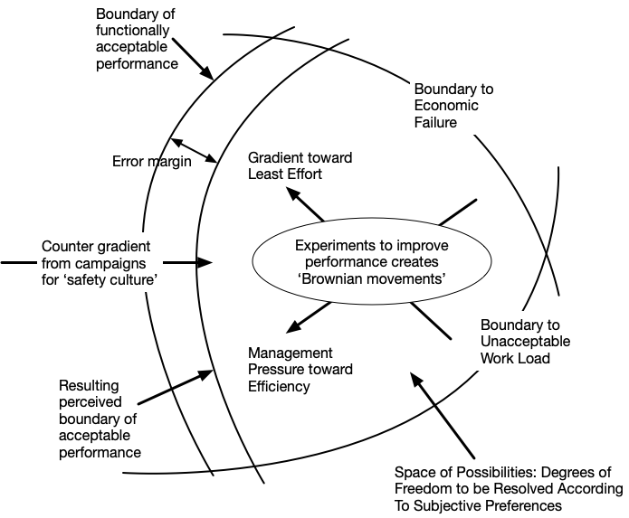
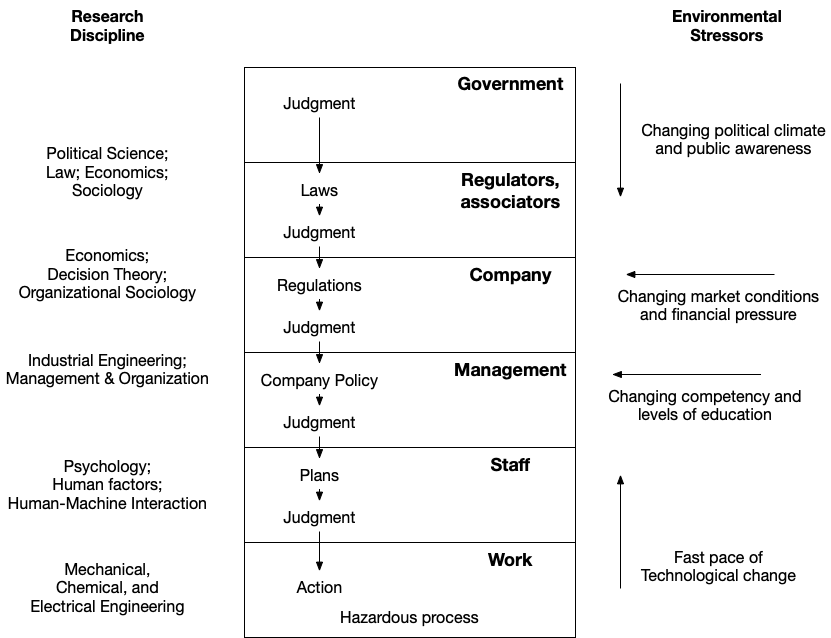

# Resilience engineering papers

## Overview

Alias: <http://resiliencepapers.club> (thanks to [John Allspaw](https://twitter.com/allspaw)).

This doc contains notes about people active in resilience engineering, as well as some influential
researchers who are no longer with us, organized alphabetically. It also includes people and papers
from related fields, such as cognitive systems engineering and naturalistic decision-making.

Some papers have a ([TWRR](http://resilienceroundup.com)) link next to them. This
stands for Thai Wood's [Resilience Roundup](http://resilienceroundup.com). Thai publishes a newsletter that
summarizes resilience engineering papers.

## Other interesting links

If you're not sure what to read first, check out:

* [learningfromincidents.io](http://learningfromincidents.io) is the Learning From Incidents in Software community site.
* [Resilience engineering: Where do I start?](intro.md) for which foundational papers to start with

For a collection of talks, check out the [Resilience Engineering, Cognitive Systems
Engineering, and Human Factors Concepts in Software
Contexts](https://www.youtube.com/playlist?list=PLb1aZTnPf3-OMChMkrr6WsokRI6LOnuem)
YouTube playlist maintained by John Allspaw.

You might also be interested in my [notes on David Woods's Resilience Engineering short course](https://github.com/lorin/res-eng-short-course-notes).

The papers linked here are also in the [zotero res-eng group](https://www.zotero.org/groups/2335189/res-eng/items).

## People

For each person, I list concepts that they reference in their writings, along
with some publications. The publications lists aren't comprehensive:
they're ones I've read or have added to my to-read list. 

* [John Allspaw](#john-allspaw)
* [Lisanne Bainbridge](#lisanne-bainbridge)
* [Andrea Baker](#andrea-baker)
* [E. Asher Balkin](#e-asher-balkin)
* [Johan Bergström](#johan-bergström)
* [Matthieu Branlat](#matthieu-branlat)
* [Sheuwen Chuang](#sheuwen-chuang)
* [Todd Conklin](#todd-conklin)
* [Richard I. Cook](#richard-i-cook)
* [Sidney Dekker](#sidney-dekker)
* [John C. Doyle](#john-c-doyle)
* [Bob Edwards](#bob-edwards)
* [Anders Ericsson](#anders-ericsson)
* [Paul Feltovich](#paul-feltovich)
* [Pedro Ferreira](http://www.resilience-engineering-association.org/user/pedro/)
* [Meir Finkel](#meir-finkel)
* [Marisa Grayson](#marisa-grayson)
* [Ivonne Andrade Herrera](#ivonne-andrade-herrera)
* [Robert Hoffman](#robert-hoffman)
* [Erik Hollnagel](#erik-hollnagel)
* [Leila Johannesen](#leila-johannesen)
* [Gary Klein](#gary-klein)
* [Elizabeth Lay](https://www.linkedin.com/in/bethlay/)
* [Nancy Leveson](#nancy-leveson)
* [Carl Macrae](#carl-macrae)
* [Laura Maguire](#laura-maguire)
* [Christopher Nemeth](#christopher-nemeth)
* [Anne-Sophie Nyssen](anne-sophie-nyssen)
* [Elinor Ostrom](#elinor-ostrom)
* [Jean Pariès](#jean-paries)
* [Emily Patterson](#emily-patterson)
* [Charles Perrow](#charles-perrow)
* [Shawna J. Perry](#shawna-j-perry)
* [Jens Rasmussen](#jens-rasmussen)
* [James Reason](#james-reason)
* [J. Paul Reed](#j-paul-reed)
* [Emilie M. Roth](#emilie-m-roth)
* [Nadine Sarter](#nadine-sarter)
* [James C. Scott](#james-c-scott)
* [Steven Shorrock](#steven-shorrock)
* [Barry Turner](#barry-turner)
* [Diane Vaughan](#diane-vaughan)
* [Robert L. Wears](#robert-l-wears)
* [David Woods](#david-woods)
* [John Wreathall](#john-wreathall)

## Some big ideas

* [The adaptive universe](#the-adaptive-universe) (David Woods)
* [Dynamic safety model](#dynamic-safety-model) (Jens Rasmussen)
* [Safety-II](#safety-i-vs-safety-ii) (Erik Hollnagel)
* [Graceful extensibility](#graceful-extensibility) (David Woods)
* [ETTO: Efficiency-tradeoff principle](#etto-principle) (Erik Hollnagel)
* [Drift into failure](#drift-into-failure) (Sidney Dekker)
* Robust yet fragile (John C. Doyle)
* [STAMP: Systems-Theoretic Accident Model & Process](#stamp) (Nancy Leveson)
* Polycentric governance (Elinor Ostrom)

Note: there are now [multiple contributors](https://github.com/lorin/resilience-engineering/graphs/contributors) to this repository.

## John Allspaw

Allspaw is the former CTO of Etsy. He applies concepts from resilience engineering to the tech industry.
He is one of the founders [Adaptive Capacity Labs](http://www.adaptivecapacitylabs.com/), a resilience engineering consultancy.

Allspaw tweets as [@allspaw](https://twitter.com/allspaw).

### Selected publications

* [STELLA: Report from the SNAFUcatchers Workshop on Coping with Complexity](https://snafucatchers.github.io/)
* [Trade-Offs Under Pressure: Heuristics and Observations Of Teams Resolving Internet Service Outages](https://www.researchgate.net/publication/295011072_Trade-Offs_Under_Pressure_Heuristics_and_Observations_Of_Teams_Resolving_Internet_Service_Outages)
* [Etsy Debrief Facilitation Guide](http://extfiles.etsy.com/DebriefingFacilitationGuide.pdf)
* [Blameless PostMortems and a Just Culture](https://codeascraft.com/2012/05/22/blameless-postmortems/) (blog)
* [Resilience engineering: learning to embrace failure](https://doi.org/10.1145/2366316.2366331)
* [Fault Injection in Production: Making the case for resiliency testing](http://queue.acm.org/detail.cfm?id=2353017)
* [Technical Debt: Challenges and Perspectives](https://doi.org/10.1109/MS.2017.99)
* [Revealing the Critical Role of Human Performance in Software](https://queue.acm.org/detail.cfm?id=3380776)
* [SRE Cognitive Work] in [Seeking SRE]

[SRE Cognitive Work]: https://www.researchgate.net/publication/343430302_SRE_Cognitive_Work
[Seeking SRE]: https://www.oreilly.com/library/view/seeking-sre/9781491978856/

### Selected talks

* [Resilience Engineering: The What and How](https://devopsdays.org/events/2019-washington-dc/program/john-allspaw/)
* [Incidents as we Imagine Them Versus How They Actually Are](https://www.youtube.com/watch?v=8DtzmV1jiyQ)
* [How your systems keep running day after day](https://www.youtube.com/watch?v=xA5U85LSk0M)
* [Problem detection (papers we love)](https://www.youtube.com/watch?v=NxctiGRI2y8)
  (presentation of [Problem detection] paper)
* [Common Ground and Coordination in Joint Activity (papers we love)](https://paperswelove.org/2016/video/john-allspaw-common-ground/) (presentation of [Common Ground and Coordination in Joint Activity] paper)
* [Amplifying sources of resilience](https://www.infoq.com/presentations/resilience-thinking-paradigm/) (presentation about applying Resilience Engineering thinking & paradigms to the world of software engineering)
* [Incidents: What Is Often Missed & What Can Be Done About That](https://www.adaptivecapacitylabs.com/blog/2020/03/30/incidents-what-is-often-missed-what-can-be-done-about-that/#fvp_10,1s)
* [Incident Analysis: How *Learning* is Different Than *Fixing*](https://www.adaptivecapacitylabs.com/blog/2020/05/06/how-learning-is-different-than-fixing/)

## Lisanne Bainbridge

Bainbridge is (was?) a psychology researcher. (*I have not been able to find any recent information about her*).

### Contributions

#### Ironies of automation

Bainbridge is famous for her 1983 [Ironies of automation] paper, which continues to
be frequently cited.

## Concepts
* automation
* design errors
* human factors/ ergonomics 
* cognitive modelling 
* cognitive architecture 
* mental workload 
* situation awareness
* cognitive error 
* skill and training 
* interface design 

## Selected publications
* [Ironies of automation] ([TWRR](https://resilienceroundup.com/issues/35/))

[Ironies of automation]: https://www.ise.ncsu.edu/wp-content/uploads/2017/02/Bainbridge_1983_Automatica.pdf

## Andrea Baker

[Baker](https://www.thehopmentor.com/) is a practitioner who provides
training services in human and organizational performance (HOP) and learning
teams.

Baker tweets as [@thehopmentor](https://twitter.com/thehopmentor).

### Concepts

* Human and organizational performance (HOP)
* Learning teams
* Industrial empathy

### Selected publications

* [A bit about HOP](https://docs.wixstatic.com/ugd/1a0149_21bcf20f158540098d3d7987ffbf3f58.pdf) (editorial)
* [A short introduction to human and organizational performance (hop) and learning teams](http://www.safetydifferently.com/a-short-introduction-to-human-and-organizational-performance-hop-and-learning-teams/) (blog post)

## E. Asher Balkin

### Selected publications

* [Resiliency Trade Space Study: The Interaction of Degraded C2 Link and Detect and Avoid Autonomy on Unmanned Aircraft](https://www.researchgate.net/publication/330222613_Resiliency_Trade_Space_Study_The_Interaction_of_Degraded_C2_Link_and_Detect_and_Avoid_Autonomy_on_Unmanned_Aircraft)

### Selected talks

* [Root cause and the wrong path](https://www.youtube.com/watch?v=kK6t-gttsJw)

## Johan Bergström

[Bergström](http://www.jbsafety.se/p/about-me.html) is a safety research and
consultant. He runs the [Master Program of Human Factors and Systems
Safety](http://www.humanfactors.lth.se/msc-programme/) at Lund University.

Bergström tweets as [@bergstrom_johan](https://twitter.com/bergstrom_johan).

### Concepts

* Analytical traps in accident investigation
   - Counterfactual reasoning
   - Normative language
   - Mechanistic reasoning
* Generic competencies

### Selected publications

* [Resilience engineering: Current status of the research and future challenges](https://www.sciencedirect.com/science/article/pii/S0925753516306130)
* [Rule- and role retreat: An empirical study of procedures and resilience](https://www.researchgate.net/publication/50917226_Rule-_and_role_retreat_An_empirical_study_of_procedures_and_resilience)
* [Team Coordination in Escalating Situations: An Empirical Study Using Mid-Fidelity Simulation]

[Team Coordination in Escalating Situations: An Empirical Study Using Mid-Fidelity Simulation]: https://portal.research.lu.se/ws/files/1376441/3014838.pdf

### Selected talks

* [Three analytical traps in accident investigation](https://www.youtube.com/watch?v=TqaFT-0cY7U)
* [Two Views on Human Error](https://www.youtube.com/watch?v=rHeukoWWtQ8)
* [What, Where and When is Risk in System Design?](https://www.youtube.com/watch?v=BtJIumyCrtE&feature=youtu.be) (Velocity 2013)

## Matthieu Branlat

### Selected publications

* [Basic patterns in how adaptive systems fail](https://www.researchgate.net/publication/284324002_Basic_patterns_in_how_adaptive_systems_fail) ([TWRR](https://resilienceroundup.com/issues/34/))

## Sheuwen Chuang

### Selected publications

* [Beyond surge: Coping with mass burn casualty in the closest hospital to the Formosa Fun Coast Dust Explosion]
* [Coping With a Mass Casualty: Insights into a Hospital’s Emergency Response and Adaptations After the Formosa Fun Coast Dust Explosion] ([TWRR](https://resilienceroundup.com/issues/76/))

[Beyond surge: Coping with mass burn casualty in the closest hospital to the Formosa Fun Coast Dust Explosion]: https://doi.org/10.1016/j.burns.2018.12.003
[Coping With a Mass Casualty: Insights into a Hospital’s Emergency Response and Adaptations After the Formosa Fun Coast Dust Explosion]: https://www.researchgate.net/publication/335366770_Coping_With_a_Mass_Casualty_Insights_into_a_Hospital's_Emergency_Response_and_Adaptations_After_the_Formosa_Fun_Coast_Dust_Explosion

## Todd Conklin

Conklin's books are on my reading list, but I haven't read anything by him
yet. I have listened to his great [Preaccident investigation
podcast](https://preaccidentpodcast.podbean.com/).

Conklin tweets as [@preaccident](https://twitter.com/preaccident).

### Selected publications
* [Pre-accident investigations: an introduction to organizational safety](https://www.amazon.com/Pre-Accident-Investigations-Todd-Conklin/dp/1409447820)
* [Pre-accident investigations: better questions - an applied approach to
  operational learning](https://www.amazon.com/gp/product/1472486137)
  
### Selected talks

Quanta - [Risk and Safety Conf 2019](https://www.youtube.com/watch?v=5WTbeFj2kJY&feature=youtu.be)

## Richard I. Cook

Cook is an anasthesiologist who studies failures in complex systems.  He is one of the founders [Adaptive Capacity Labs](http://www.adaptivecapacitylabs.com/), a resilience engineering consultancy.

Cook tweets as [@ri_cook](https://twitter.com/ri_cook).

### Concepts
* complex systems
* degraded mode
* sharp end (c.f. Reason's blunt end)
* Going solid
* Cycle of error
* "new look"
* first vs second stories

### Selected publications

* [How complex systems fail](https://www.adaptivecapacitylabs.com/HowComplexSystemsFail.pdf)
* [*Where* complex systems fail](https://www.snafucatchers.com/single-post/2017/11/14/void-Incidents-as-Untyped-Pointers)
* [Distancing through differencing: An obstacle to organizational learning following accidents](https://www.researchgate.net/publication/292504703_Distancing_through_differencing_An_obstacle_to_organizational_learning_following_accidents)
* [Being bumpable](http://csel.eng.ohio-state.edu/productions/woodscta/media/beingbump.pdf) ([TWRR](https://www.getrevue.co/profile/resilience/issues/resilience-roundup-being-bumpable-issue-33-177340))
* [Behind Human Error]
* [Incidents - markers of resilience or brittleness?](https://www.researchgate.net/publication/292504952_Incidents_-_markers_of_resilience_or_brittleness)
* [“Going solid”: a model of system dynamics and consequences for patient safety](https://qualitysafety.bmj.com/content/14/2/130) ([TWRR](https://resilienceroundup.com/issues/going-solid-a-model-of-system-dynamics-and-consequences-for-patient-safety/))
* [Operating at the Sharp End: The Complexity of Human Error](https://www.researchgate.net/publication/313407259_Operating_at_the_Sharp_End_The_Complexity_of_Human_Error)
* [Patient boarding in the emergency department as a symptom of complexity-induced risks](https://www.researchgate.net/publication/312624891_Patient_boarding_in_the_emergency_department_as_a_symptom_of_complexity-induced_risks)
* [Sensemaking, Safety, and Cooperative Work in the Intensive Care Unit](https://www.researchgate.net/publication/220579381_Sensemaking_Safety_and_Cooperative_Work_in_the_Intensive_Care_Unit)
* [Medication Reconciliation Is a Window into “Ordinary” Work](https://www.taylorfrancis.com/books/e/9781317164777/chapters/10.1201/9781315572529-4)
* [Cognitive consequences of clumsy automation on high workload, high consequence human performance]
* [Implications of automation surprises in aviation for the future of total intravenous anesthesia (TIVA)]
* [The Messy Details: Insights From the Study of Technical Work in Healthcare]
* [Nosocomial automation: technology-induced complexity and human performance]
* [The New Look at Error, Safety, and Failure: A Primer for Health Care]
* [Grounding explanations in evolving, diagnostic situations]
* [A Tale of Two Stories: Contrasting Views of Patient Safety] (appendix B, starting on page 64 (numbered 52) contains the talk by Charles Billings, MD, Chief Scientist (retired), NASA Ames on the lessons learned from incident reporting in aviation. Dr. Billings designed, started, and managed the Aviation Safety REporting System)
* ["Those found responsible have been sacked": some observations on the usefulness of error](http://citeseerx.ist.psu.edu/viewdoc/download?doi=10.1.1.623.5749&rep=rep1&type=pdf)
* [Perspectives on Human Error: Hindsight Biases and Local Rationality]
* [Mistaking Error]
* [Adapting to new technology in the operating room]
* [Verite, Abstraction, and Ordinateur Systems in the Evolution of Complex Process Control](https://www.researchgate.net/publication/3657912_Verite_abstraction_and_ordinateur_systems_in_the_evolution_of_complex_process_control)
* [Collaborative Cross-Checking to Enhance Resilience] ([TWRR](https://resilienceroundup.com/issues/73/))
* [Resilience Engineering: New directions for measuring and maintaining safety in complex systems]
* [The Role of Automation in Complex System Failures]
* [Thinking about accidents and systems](https://www.researchgate.net/publication/228352596_Thinking_about_accidents_and_systems)
* [The Stockholm blizzard of 2012](https://www.taylorfrancis.com/books/e/9781315605739/chapters/10.1201/9781315605739-11)
* [New Arctic Air Crash Aftermath Role-Play Simulation Orchestrating a Fundamental Surprise]
* [Dissenting Statement: Health IT Is a Class III Medical Device](https://www.nap.edu/read/13269/chapter/14)
* [Nine Steps to Move Forward From Error]
* [Gaps in the continuity of care and progress on patient safety]
* [Above the Line, Below the Line](https://queue.acm.org/detail.cfm?id=3380777) ([TWRR](https://resilienceroundup.com/issues/68/))
* [Coping With a Mass Casualty: Insights into a Hospital’s Emergency Response and Adaptations After the Formosa Fun Coast Dust Explosion] ([TWRR](https://resilienceroundup.com/issues/76/))
* [SRE Cognitive Work] in [Seeking SRE]
* [Building and revising adaptive capacity sharing for technical incident response: A case of resilience engineering](https://www.sciencedirect.com/science/article/pii/S0003687020301903) ([TWRR](https://resilienceroundup.com/issues/building-and-revising-adaptive-capacity-sharing-for-technical-incident-response-a-case-of-resilience-engineering/))
* [Automation, interaction, complexity, and failure: A case study]
* [Human Performance in Anesthesia]

[Behind Human Error]: https://www.amazon.com/Behind-Human-Error-David-Woods/dp/0754678342
[Cognitive consequences of clumsy automation on high workload, high consequence human performance]: https://ntrs.nasa.gov/search.jsp?R=19910011398
[Implications of automation surprises in aviation for the future of total intravenous anesthesia (TIVA)]: https://doi.org/10.1016/S0952-8180(96)90009-4
[The Messy Details: Insights From the Study of Technical Work in Healthcare]: https://doi.org/10.1109%2FTSMCA.2004.836802
[Nosocomial automation: technology-induced complexity and human performance]: https://www.researchgate.net/profile/David_Woods11/publication/224649052_Nosocomial_automation_technology-induced_complexity_and_human_performance/links/59399b1da6fdcc58ae902c49/Nosocomial-automation-technology-induced-complexity-and-human-performance.pdf
[The New Look at Error, Safety, and Failure: A Primer for Health Care]: https://pdfs.semanticscholar.org/67f7/53ec089e5a8879f241e2be867dad0a2026fb.pdf
[Grounding explanations in evolving, diagnostic situations]: https://pdfs.semanticscholar.org/1bed/356b5aa67c701f5bad6d943768622095f418.pdf
[A Tale of Two Stories: Contrasting Views of Patient Safety]: https://www.researchgate.net/publication/245102691_A_Tale_of_Two_Stories_Contrasting_Views_of_Patient_Safety
[Perspectives on Human Error: Hindsight Biases and Local Rationality]: https://www.nifc.gov/PUBLICATIONS/acc_invest_march2010/speakers/Perspectives%20on%20Human%20Error.pdf
[Mistaking Error]: https://www.researchgate.net/publication/328149714_Mistaking_Error
[Adapting to new technology in the operating room]: https://www.researchgate.net/publication/14230576_Adapting_to_New_Technology_in_the_Operating_Room
[Collaborative Cross-Checking to Enhance Resilience]: https://www.researchgate.net/publication/220579448_Collaborative_Cross-Checking_to_Enhance_Resilience
[Resilience Engineering: New directions for measuring and maintaining safety in complex systems]: https://pdfs.semanticscholar.org/a0d3/9cc66adc64e297048a32b71aeee209a451af.pdf
[The Role of Automation in Complex System Failures]: https://www.researchgate.net/publication/232191704_The_Role_of_Automation_in_Complex_System_Failures
[New Arctic Air Crash Aftermath Role-Play Simulation Orchestrating a Fundamental Surprise]: https://www.researchgate.net/publication/2484621_New_Arctic_Air_Crash_Aftermath_Role-Play_Simulation_Orchestrating_a_Fundamental_Surprise
[Nine Steps to Move Forward From Error]: http://csel.eng.ohio-state.edu/productions/pexis/readings/submod4/nine%20steps%20CTW2002.pdf
[Gaps in the continuity of care and progress on patient safety]: https://www.ncbi.nlm.nih.gov/pmc/articles/PMC1117777/
[Automation, interaction, complexity, and failure: A case study]: https://doi.org/10.1016/j.ress.2006.01.009
[Human Performance in Anesthesia]: http://dx.doi.org/10.13140/RG.2.2.29675.36648

### Selected talks
* [How Complex Systems Fail](https://www.youtube.com/watch?v=2S0k12uZR14) (Velocity 2012)
* [Resilience in Complex Adaptive Systems: Operating at the Edge of Failure](https://www.youtube.com/watch?v=PGLYEDpNu60&feature=youtu.be) (Velocity 2013)
* [Lectures on the study of cognitive work](https://vimeo.com/showcase/6184024) (Graduate student lecture-discussions at The Royal Institute of Technology, Huddinge, SWEDEN in 2012 )
* [Panel discussion: Safety Culture, Lean, and DevOps] (DOES 2017)
* [Working at the center of the Cyclone](https://www.youtube.com/watch?v=3ZP98stDUf0&feature=youtu.be) (DOES 2018)
* [A Few Observations on the Marvelous Resilience of Bone & Resilience Engineering](https://www.youtube.com/watch?v=8LbePBiOvZ4) (REdeploy 2019)

[Panel discussion: Safety Culture, Lean, and DevOps]: https://www.youtube.com/watch?v=gtxtb9z_4FY&feature=youtu.be

## Sidney Dekker

Dekker is a human factors and safety researcher with a background in aviation.
His books aimed at a lay audience (Drift Into Failure, Just Culture, The Field Guide to 'Human Error' investigations)
have been enormously influential. He was a founder of the MSc programme in Human Factors & Systems Safety at Lund University.
His PhD advisor is [David Woods](#david-woods).

Dekker tweets as [@sidneydekkercom](https://twitter.com/sidneydekkercom).

### Contributions

#### Drift into failure

Dekker developed the theory of *drift*, characterized by five concepts:

1. Scarcity and competition
1. Decrementalism, or small steps
1. Sensitive dependence on initial conditions
1. Unruly technology
1. Contribution of the protective structure

#### Just Culture

Dekker examines how cultural norms defining justice can be re-oriented to minimize the negative impact and maximize learning when things go wrong.

1.  Retributive justice as society's traditional idea of justice:  distributing punishment to those responsible based on severity of the violation
2.  Restorative justice as an improvement for both victims and practicioners:  distributing obligations of rebuilding trust to those responsible based on who is hurt and what they need
3.  First, second, and third victims:  an incident's negative impact is felt by more than just the obvious victims
4.  Learning theory:  people break rules when they have learned there are no negative consequences, and there are actually positive consequences - in other words, they break rules to get things done to meet production pressure
5.  Reporting culture:  contributing to reports of adverse events is meant to help the organization understand what went wrong and how to prevent recurrence, but accurate reporting requires appropriate and proportionate accountability actions
6.  Complex systems:  normal behavior of practicioners and professionals in the context of a complex system can appear abnormal or deviant in hindsight, particularly in the eyes of non-expert juries and reviewers
7.  The nature of practicioners:  professionals want to do good work, and therefore want to be held accountable for their mistakes; they generally want to help similarly-situated professionals avoid the same mistake.

### Concepts
* Drift into failure
* Safety differently
* New view vs old view of human performance & error
* Just culture
* complexity
* broken part
* Newton-Descartes
* diversity
* systems theory
* unruly technology
* decrementalism
* generic competencies

### Selected publications

* [Drift into failure](https://www.amazon.com/Drift-into-Failure-Sidney-Dekker/dp/1409422216)
* [Reconstructing human contributions to accidents: the new view on error and performance](http://citeseerx.ist.psu.edu/viewdoc/download?doi=10.1.1.411.4985&rep=rep1&type=pdf)
* [The field guide to understanding 'human error'](https://www.amazon.com/Field-Guide-Understanding-Human-Error/dp/1472439058s://www.amazon.com/Field-Guide-Understanding-Human-Error/dp/1472439058)
* [Behind Human Error](https://www.amazon.com/gp/product/B075QFGTNP/ref=x_gr_w_glide_bb?ie=UTF8&tag=x_gr_w_glide_bb-20&linkCode=as2&camp=1789&creative=9325&creativeASIN=B075QFGTNP&SubscriptionId=1MGPYB6YW3HWK55XCGG2)
* [Rule- and role retreat: An empirical study of procedures and resilience](https://www.researchgate.net/publication/50917226_Rule-_and_role_retreat_An_empirical_study_of_procedures_and_resilience?enrichId=rgreq-23625e555a0d8e5250c74f24b5fd01ca-XXX&enrichSource=Y292ZXJQYWdlOzUwOTE3MjI2O0FTOjk3MzU5NjY5MjM1NzQ1QDE0MDAyMjM3NjI5NDY%3D&el=1_x_2&_esc=publicationCoverPdf)
* [Anticipating the effects of technological change: A new era of dynamics for human factors](https://www.researchgate.net/publication/247512351_Anticipating_the_effects_of_technological_change_A_new_era_of_dynamics_for_human_factors)
* [Why do things go right?](http://www.safetydifferently.com/why-do-things-go-right/)
* [Six stages to the new view of human error](http://www.humanfactors.lth.se/fileadmin/lusa/Sidney_Dekker/articles/2007/SafetyScienceMonitor.pdf)
* [Behind Human Error]
* [Employees: A Problem to Control or Solution to Harness?](http://sidneydekker.com/wp-content/uploads/2014/08/DekkerPS2014.pdf)
* [Team Coordination in Escalating Situations: An Empirical Study Using Mid-Fidelity Simulation]
* [Resilience Engineering: New directions for measuring and maintaining safety in complex systems]
* [Illusions of explanation: A critical essay on error classification](http://www.humanfactors.lth.se/fileadmin/lusa/Sidney_Dekker/articles/2003_and_before/Illusions_of_explanation.pdf)
* [Failure to adapt or adaptations that fail: contrasting models on procedures and safety](http://citeseerx.ist.psu.edu/viewdoc/download?doi=10.1.1.606.3361&rep=rep1&type=pdf)
* [Human factors and folk models]
* [The High Reliability Organization Perspective] ([TWRR](https://resilienceroundup.com/issues/09/))
* [Illusions of explanation: A critical essay on error classification](http://www.humanfactors.lth.se/fileadmin/lusa/Sidney_Dekker/articles/2003_and_before/Illusions_of_explanation.pdf) ([TWRR](https://resilienceroundup.com/issues/42/))
* [Safety II professionals: How resilience engineering can transform safety practice] ([TWRR](https://resilienceroundup.com/issues/64/))
* [The complexity of failure: implications of complexity theory for safety investigation](https://static1.squarespace.com/static/53b78765e4b0949940758017/t/5722beb0d51cd4d11675a69c/1461894833950/Dekker%2C+Cilliers+and+Hofmeyr+-+The+Complexity+of+Failure.pdf)

[Human factors and folk models]: https://link.springer.com/article/10.1007%2Fs10111-003-0136-9
[The High Reliability Organization Perspective]: http://sidneydekker.com/wp-content/uploads/2013/01/CH005.pdf
[Safety II professionals: How resilience engineering can transform safety practice]: https://doi.org/10.1016/j.ress.2019.106740

### Selected talks

* [Panel discussion: Safety Culture, Lean, and DevOps]

## John C. Doyle

[Doyle](http://www.cds.caltech.edu/~doyle/wiki/index.php?title=Main_Page) is a
control systems researcher. He is seeking to identify the universal laws that capture the
behavior of resilient systems, and is concerned with the architecture of such
systems.

### Concepts
* Robust yet fragile
* layered architectures
* constraints that deconstrain
* protocol-based architectures
* emergent constraints
* Universal laws and architectures
* conservation laws
* universal architectures
* Highly optimized tolerance
* Doyle's catch

#### Doyle's catch

*Doyle's catch* is a term introduced by David Woods, but attributed to John Doyle. Here's how 
[Woods quotes Doyle](https://www.researchgate.net/publication/303832480_The_Risks_of_Autonomy_Doyles_Catch):

> Computer-based simulation and rapid prototyping tools are now broadly available and powerful enough that it is
> relatively easy to demonstrate almost anything, provided that conditions are made sufficiently idealized. 
> However, the real world is typically far from idealized, and thus a system must have enough robustness in order to close 
> the gap between demonstration and the real thing. 

### Selected publications

* [Universal Laws and Architectures](http://www.cis.upenn.edu/~ngns/docs/Review_2010/Doyle%20MURI%202010.pdf) (slides)
* [Contrasting Views of Complexity and Their Implications For Network-Centric Infrastructures](http://dx.doi.org/10.1109/TSMCA.2010.2048027)
* [Architecture, constraints, and behavior](https://www.pnas.org/content/108/Supplement_3/15624)
* [The “robust yet fragile” nature of the Internet](https://doi.org/10.1073/pnas.0501426102)
* [Highly Optimized Tolerance: Robustness and Design in Complex Systems](http://dx.doi.org/10.1103/physrevlett.84.2529)
* [Robust efficiency and actuator saturation explain healthy heart rate control and variability](https://doi.org/10.1073/pnas.1401883111)

## Bob Edwards

[Edwards](http://hopcoach.net/) is a practitioner who provides
training services in human and organizational performance (HOP).

Edwards tweets as [@thehopcoach](https://twitter.com/thehopcoach).

## Anders Ericsson

Ericsson introduced the idea of *deliberate practice* as a mechanism for
achieving high level of expertise.

Ericsson isn't directly associated with the field of resilience engineering.
However, Gary Klein's work is informed by his, and I have a particular
interest in how people improve in expertise, so I'm including him here.

### Concepts

* Expertise
* Deliberate practice
* Protocol analysis

### Selected publications

* [Peak: secrets from the new science of expertise](https://www.amazon.com/Peak-Secrets-New-Science-Expertise/dp/1531864880/)
* [Protocol analysis: verbal reports as data](https://www.amazon.com/Protocol-Analysis-Revd-Verbal-Reports/dp/0262550237)

## Paul Feltovich

[Feltovich](https://www.ihmc.us/groups/pfeltovich/) is a retired Senior Research Scientist at the Florida Institute for Human & Machine Cognition (IHMC),
who has done extensive reserach in human expertise.

### Selected publications

* [Common Ground and Coordination in Joint Activity]
* [Issue of expert flexibility in contexts characterized by complexity and change](https://www.researchgate.net/publication/232465540_Issue_of_expert_flexibility_in_contexts_characterized_by_complexity_and_change)
* [A rose by any other name...would probably be given an acronym]
* [Learners' (mis)understanding of important and difficult concepts: a challenge to smart machines in education](https://www.researchgate.net/publication/234818797_Learners'_misunderstanding_of_important_and_difficult_concepts_a_challenge_to_smart_machines_in_education)
* [Ten challenges for making automation a team player] ([TWRR](https://resilienceroundup.com/issues/ten-challenges-for-making-automation-a-team-player-in-joint-human-agent-activity/))

[Common Ground and Coordination in Joint Activity]: http://jeffreymbradshaw.net/publications/Common_Ground_Single.pdf
[A rose by any other name...would probably be given an acronym]: https://www.researchgate.net/publication/3454029_A_rose_by_any_other_namewould_probably_be_given_an_acronym
[Ten challenges for making automation a team player]: https://ieeexplore.ieee.org/abstract/document/1363742

## Meir Finkel

Finkel is a Colonel in the Israeli Defense Force (IDF) and the Director of the IDF's Ground Forces Concept Development and Doctrine Department

### Selected publications
* [On Flexibility: Recovery from Technological and Doctrinal Surprise on the Battlefield](https://www.amazon.com/Flexibility-Recovery-Technological-Doctrinal-Battlefield/dp/0804774897/ref=sr_1_3?ie=UTF8&qid=1546046916&sr=8-3&keywords=on+flexibility)

## Marisa Grayson

[Grayson](https://www.linkedin.com/in/marisa-grayson/) is a cognitive systems engineer at Mile Two, LLC.

### Selected Publications

* [Approaching Overload: Diagnosis and Response to Anomalies in Complex and Automated Production Software Systems](https://www.researchgate.net/publication/333091997_Approaching_Overload_Diagnosis_and_Response_to_Anomalies_in_Complex_and_Automated_Production_Software_Systems)
* [Cognitive Work of Hypothesis Exploration During Anomaly Response](https://queue.acm.org/detail.cfm?id=3380778)

## Ivonne Andrade Herrera

[Herrera](https://www.ntnu.edu/employees/ivonne.a.herrera) is an associate professor in 
the department of industrial economics and technology management at NTNU and a
senior research scientist at SINTEF. Her areas of expertise include safety management and
resilience engineering in avionics and air traffic management.

### Selected publications

* [Organisational accidents and resilient organisations: six perspectives](https://www.sintef.no/globalassets/upload/teknologi_og_samfunn/sikkerhet-og-palitelighet/rapporter/sintef-a17034-organisational-accidents-and-resilience-organisations-six-perspectives.-revision-2.pdf) (SINTEF A17034 report)

See also: [list of publications](https://wo.cristin.no/as/WebObjects/cristin.woa/wa/fres?sort=ar&pnr=30556&action=sok)

## Robert Hoffman

[Hoffman](https://www.ihmc.us/groups/rhoffman/) is a senior research scientist at Florida Institute for Human & Machine Cognition (IHMC),
who has done extensive reserach in human expertise.

### Selected publications

* [Measuring resilience](https://journals.sagepub.com/doi/abs/10.1177/0018720816686248)
* [Myths of automation and their implications for military procurement]
* [The Seven Deadly Myths of "Autonomous Systems"]
* [A rose by any other name...would probably be given an acronym]
* [Seeing the invisible: perceptual-cognitive aspects of expertise](https://cmapspublic3.ihmc.us/rid=1G9NSY15K-N7MJMZ-LC5/SeeingTheInvisible.pdf)
* [Toward a Theory of Complex and Cognitive Systems]
* [Macrocognition] ([TWRR](https://resilienceroundup.com/issues/62/))

[Myths of automation and their implications for military procurement]:https://www.researchgate.net/publication/326000581_Myths_of_automation_and_their_implications_for_military_procurement 

[The Seven Deadly Myths of "Autonomous Systems"]: https://www.researchgate.net/publication/260304859_The_Seven_Deadly_Myths_of_Autonomous_Systems

[Toward a Theory of Complex and Cognitive Systems]: https://www.researchgate.net/publication/3454245_Toward_a_Theory_of_Complex_and_Cognitive_Systems

[Macrocognition]: https://pdfs.semanticscholar.org/df74/b2909f54b41a485cd4c0189fc4aa19d176d0.pdf

### Concepts

#### Seven deadly myths of autonomous systems:

1. "Autonomy" is unidimensional.
2. The conceptualization of "levels of autonomy" is a useful scientific grounding for the development of autonomous system roadmaps.
3. Autonomy is a widget.
4. Autonomous systems are autonomous.
5. Once achieved, full autonomy obviates the need for human-machine collaboration.
6. As machines acquire more autonomy, they will work as simple sibstitutes (or multipliers) of human capability
7. "Full autonomy"  is not only possible, but is always desireable.

## Erik Hollnagel

### Contributions

#### ETTO principle

Hollnagel proposed that there is always a fundamental tradeoff between
efficiency and thoroughness, which he called the *ETTO principle*.

#### Safety-I vs. Safety-II

Safety-I: avoiding things that go wrong
* looking at what goes wrong
* bimodal view of work and activities (acceptable vs unacceptable)
* find-and-fix approach
* prevent transition from 'normal' to 'abnormal'
* causality credo: believe that adverse outcomes happen because something goes
  wrong (they have causes that can be found and treated)
* it either works or it doesn't
* systems are decomposable
* functioning is bimodal

Safety-II: performance variability rather than bimodality
* the system’s ability to succeed under varying conditions, so that the number
  of intended and acceptable outcomes (in other words, everyday activities) is
  as high as possible
* performance is always variable
* performance variation is ubiquitous
* things that go right
* focus on frequent events
* remain sensitive to possibility of failure
* be thorough as well as efficient

#### FRAM

Hollnagel proposed the Functional Resonance Analysis Method (FRAM) for modeling
complex socio-technical systems.

#### Four abilities necessary for resilient performance
* respond
* monitor
* learn
* anticipate

### Concepts
* ETTO (efficiency thoroughness tradeoff) principle
* FRAM (functional resonance analysis method)
* Safety-I and Safety-II
* things that go wrong vs things that go right
* causality credo
* performance variability
* bimodality
* emergence
* work-as-imagined vs. work-as-done
* joint cognitive systems
* systems of the first, second, third, fourth kind

### Selected publications

* [The ETTO Principle: Efficiency-Thoroughness Trade-Off: Why Things That Go Right Sometimes Go Wrong](https://www.amazon.com/ETTO-Principle-Efficiency-Thoroughness-Trade-Off-Sometimes/dp/0754676781/ref=sr_1_1?s=books&ie=UTF8&qid=1545965837&sr=1-1&keywords=etto+principle)
* [From Safety-I to Safety-II: A White Paper](https://www.skybrary.aero/bookshelf/books/2437.pdf)
* [Safety-II in Practice](https://www.amazon.com/Safety-II-Practice-Developing-Resilience-Potentials/dp/1138708925)
* [Safety-I and Safety-II: The past and future of safety management](https://www.amazon.com/gp/product/1472423089/ref=dbs_a_def_rwt_bibl_vppi_i0)
* [FRAM: The Functional Resonance Analysis Method: Modelling Complex Socio-technical System](https://www.amazon.com/gp/product/B010WIDYE8/ref=dbs_a_def_rwt_bibl_vppi_i15)
* [Joint Cognitive Systems: Patterns in Cognitive Systems Engineering](https://www.amazon.com/gp/product/0849339332/ref=x_gr_w_bb?ie=UTF8&tag=x_gr_w_bb-20&linkCode=as2&camp=1789&creative=9325&creativeASIN=0849339332&SubscriptionId=1MGPYB6YW3HWK55XCGG2)
* [Resilience Engineering: Concepts and Precepts]
* [I want to believe: some myths about the management of industrial safety](http://dx.doi.org/10.1007/s10111-012-0237-4)
* [Resilience engineering – Building a Culture of Resilience](http://www.ptil.no/getfile.php/1325150/PDF/Seminar%202013/Integrerte%20operasjoner/Hollnagel_RIO_presentation.pdf) (slides)
* [Anomaly Response]
* [Cognitive Systems Engineering: New wine in new bottles] ([TWRR](https://www.getrevue.co/profile/resilience/issues/resilience-roundup-cognitive-systems-engineering-new-wine-in-new-bottles-issue-32-175912))
* [Epilogue: Resilience Engineering Precepts](https://www.researchgate.net/publication/265074845_Epilogue_Resilience_Engineering_Precepts)
* [Resilience Engineering: New directions for measuring and maintaining safety in complex systems]
* [Resilience Engineering](https://erikhollnagel.com/ideas/resilience-engineering.html) (web essay)
* [RAG - Resilience Analysis Grid](http://erikhollnagel.com/onewebmedia/RAG%20Outline%20V2.pdf)
* [Resilience engineering in practice: a guidebook]
* [Mapping Cognitive Demands in Complex Problem-Solving Worlds] (mentions disturbance management)
* [Human factors and folk models]
* [Designing for joint cognitive systems](https://www.researchgate.net/publication/4213914_Designing_for_joint_cognitive_systems)
* [Macrocognition] ([TWRR](https://resilienceroundup.com/issues/62/))

[Resilience Engineering: Concepts and Precepts]: https://www.amazon.com/gp/product/B009KNDF64/ref=x_gr_w_glide_bb?ie=UTF8&tag=x_gr_w_glide_bb-20&linkCode=as2&camp=1789&creative=9325&creativeASIN=B009KNDF64&SubscriptionId=1MGPYB6YW3HWK55XCGG2
[Anomaly Response]: https://docs.wixstatic.com/ugd/3ad081_f46dda684154447583c8a5b282b60cc2.pdf
[Cognitive Systems Engineering: New wine in new bottles]: https://www.ida.liu.se/~729A15/mtrl/CSEnew.pdf?utm_campaign=Resilience%20Roundup&utm_medium=email&utm_source=Revue%20newsletter
[Resilience Roundup]: https://resilienceroundup.com/
[Mapping Cognitive Demands in Complex Problem-Solving Worlds]: https://www.researchgate.net/publication/220108174_Mapping_Cognitive_Demands_in_Complex_Problem-Solving_Worlds<Paste>

## Leila Johannesen

[Johannesen](https://www.linkedin.com/in/leilajohannesen/) is currently a UX researcher and community advocate at IBM.
Her PhD dissertation work examined how humans cooperate, including studies of anesthesiologists.

### Concepts

* common ground

### Selected publications

* [Grounding explanations in evolving, diagnostic situations]
* [Maintaining common ground: an analysis of cooperative communication in the operating room](https://www.abdn.ac.uk/iprc/documents/Communication%20Book%20Chapter.pdf)
* [Behind Human Error]

## Gary Klein

Klein studies how experts are able to quickly make effective decisions in high-tempo situations. 

Klein tweets as [@KleInsight](https://twitter.com/KleInsight).

### Concepts

* naturalistic decision making (NDM)
* intuitive expertise
* cognitive task analysis
* common ground
* problem detection
* automation as a "team player"

### Selected publications

* [Sources of power: how people make decisions](https://www.amazon.com/gp/product/0262534290/ref=dbs_a_def_rwt_bibl_vppi_i0)
* [Common Ground and Coordination in Joint Activity]
* [Working minds: a practitioner's guide to cognitive task analysis](https://www.amazon.com/gp/product/0262532816/ref=dbs_a_def_rwt_bibl_vppi_i5)
* [Patterns in Cooperative Cognition](https://www.researchgate.net/publication/262449980_Patterns_in_Cooperative_Cognition)
* [Can We Trust Best Practices? Six Cognitive Challenges of Evidence-Based Approaches]
* [Conditions for intuitive expertise: a failure to disagree](http://dx.doi.org/10.1037/a0016755)
* [Problem detection]
* [Ten challenges for making automation a team player] ([TWRR](https://resilienceroundup.com/issues/66))
* [Decision making in action: models and methods](http://www.macrocognition.com/documents/Decision-Making-in-Action-Models-and-Methods-0316.pdf)
* [Critical decision method for eliciting knowledge](https://ieeexplore.ieee.org/document/31053)
* [A recognition-primed decision (RPD) model of rapid decision making](https://pdfs.semanticscholar.org/0672/092ecc507fb41d81e82d2986cf86c4bff14f.pdf)
* [Seeing the invisible: perceptual-cognitive aspects of expertise](https://cmapspublic3.ihmc.us/rid=1G9NSY15K-N7MJMZ-LC5/SeeingTheInvisible.pdf)
* [Patterns in Cooperative Cognition]
* [The strengths and limitations of teams for detecting problems](https://link.springer.com/article/10.1007/s10111-005-0024-6)
* [Macrocognition] ([TWRR](https://resilienceroundup.com/issues/62/))

[Problem detection]: https://www.researchgate.net/publication/220579480_Problem_detection
[Patterns in Cooperative Cognition]: https://www.researchgate.net/publication/262449980_Patterns_in_Cooperative_Cognition
[Can We Trust Best Practices? Six Cognitive Challenges of Evidence-Based Approaches]: https://journals.sagepub.com/doi/abs/10.1177/1555343416637520?journalCode=edma

### Selected talks

* [Problem detection](https://www.youtube.com/watch?v=UXx51qK4ItQ&feature=emb_title)

## Nancy Leveson

Nancy Leveson is a computer science researcher with a focus in software safety.

### Contributions

#### STAMP

Leveson developed the accident causality model known as STAMP: the Systems-Theoretic Accident Model and Process.

See [STAMP](STAMP.md) for some more detailed notes of mine.

### Concepts

* Software safety
* STAMP (systems-theoretic accident model and processes)
* STPA (system-theoretic process analysis) hazard analysis technique
* CAST (causal analysis based on STAMP) accident analysis technique
* Systems thinking
* hazard
* interactive complexity
* system accident
* dysfunctional interactions
* safety constraints
* control structure
* dead time
* time constants
* feedback delays

### Selected publications
* [A New Accident Model for Engineering Safer Systems](http://sunnyday.mit.edu/accidents/safetyscience-single.pdf)
* [Engineering a safer world](https://mitpress.mit.edu/books/engineering-safer-world)
* [STPA Handbook](http://psas.scripts.mit.edu/home/get_file.php?name=STPA_handbook.pdf)
* [Safeware](https://www.amazon.com/Safeware-Computers-Nancy-G-Leveson/dp/0201119722)
* [Resilience Engineering: Concepts and Precepts](https://www.amazon.com/gp/product/B009KNDF64/ref=x_gr_w_glide_bb?ie=UTF8&tag=x_gr_w_glide_bb-20&linkCode=as2&camp=1789&creative=9325&creativeASIN=B009KNDF64&SubscriptionId=1MGPYB6YW3HWK55XCGG2)
* [High-pressure steam engines and computer software](http://dx.doi.org/10.1145/143062.143076)
* [Resilience Engineering: Concepts and Precepts]

## Carl Macrae

[Macrae](https://www.nottingham.ac.uk/business/people/lizcjm.html) is a social psychology
researcher who has done safety research in multiple domains, including aviation
and healthcare. He helped set up the new healthcare investigation agency in
England. He is currently a professor of organizational behavior and psychology
at the Notthingham University Business School.

Macrae tweets at [@CarlMacrae](https://twitter.com/CarlMacrae).

### Concepts

* risk resilience

### Selected publications

* [Close calls](http://www.closecalls.cc/)
* [Early warnings, weak signals and learning from healthcare disasters](https://qualitysafety.bmj.com/content/23/6/440)

## Laura Maguire

[Maguire](https://www.linkedin.com/in/lauramaguire/) is a cognitive systems
engineering researcher with a PhD from Ohio State
University. Maguire has done safety work in multiple domains, including
forestry, avalanches, and software services. She currently works as a researcher
at [jeli.io](jeli.io)

Maguire tweets as [@LauraMDMaguire](https://twitter.com/lauramdmaguire).

### Selected publications

* [Managing the Hidden Costs of Coordination](https://queue.acm.org/detail.cfm?id=3380779)
* [Controlling the Costs of Coordination in Large-scale Distributed Software Systems](http://rave.ohiolink.edu/etdc/view?acc_num=osu1593661547087969) (PhD dissertation)

### Selected talks

* [How Many Is Too Much? Exploring Costs of Coordination During Outages](https://www.infoq.com/presentations/incident-command-system/)
* [Mental models – why saying “I didn’t know it worked that way” is a sign of expertise not incompetence](https://www.youtube.com/watch?v=VEprjLtHzg0)
* [Operating at the edge of the envelope](https://re-deploy.io/videos/27-maguire.html)

## Christopher Nemeth

[Nemeth](https://www.linkedin.com/in/christopher-nemeth-6651204) is a principal scientist at Applied Resesarch Associates, Inc.

### Selected publications

* [Replacing Hindsight With Insight: Toward Better Understanding of Diagnostic Failures]

[Replacing Hindsight With Insight: Toward Better Understanding of Diagnostic Failures]: https://www.semanticscholar.org/paper/Replacing-hindsight-with-insight%3A-toward-better-of-Wears-Nemeth/1bef45cae7375eddc8ee584dff100d200d812a8d

## Anne-Sophie Nyssen

[Nyssen](http://www.lecit.ulg.ac.be/equipe/anne-sophie-nyssen/) is a psychology professor at the University of Liège,
who does research on human error in complex systems, in particular in medicine.

A list of publications can be found on her website linked above.

## Elinor Ostrom

[Ostrom](http://elinorostrom.com/) was a Nobel-prize winning economics and
political science researcher.

### Selected publications
* [Coping with tragedies of the commons](https://www.annualreviews.org/doi/abs/10.1146/annurev.polisci.2.1.493)
* [Governing the Commons: The Evolution of Institutions for Collective Action](https://www.amazon.com/Governing-Commons-Evolution-Institutions-Collective/dp/1107569788)

### Concepts

* tragedy of the commons
* polycentric governance
* social-ecological system framework

## Jean Pariès

Pariès is the president of [Dédale](http://www.dedale.net/dedale_en/), a safety and human factors consultancy.

### Selected publications
* [Resilience engineering in practice: a guidebook]

[Resilience engineering in practice: a guidebook]: https://www.crcpress.com/Resilience-Engineering-in-Practice-A-Guidebook/Paries-Wreathall-Hollnagel/p/book/9781472420749
### Selected talks

* [Predicting The fatal flaws: The challenge of The unpredictable...](paries-keynote-2015.pptx)

## Emily Patterson

[Patterson](https://hrs.osu.edu/faculty-and-staff/faculty-directory/patterson-emily)
is a researcher who applies human factors engineering to improve patient safety
in healthcare.

### Selected publications

* [Patient boarding in the emergency department as a symptom of complexity-induced risks](https://www.researchgate.net/publication/312624891_Patient_boarding_in_the_emergency_department_as_a_symptom_of_complexity-induced_risks)
* [Using observational study as a tool for discovery: uncovering cognitive and collaborative demands and adaptive strategies]
* [Voice Loops as Coordination Aids in Space Shuttle Mission Control]
* [Functionally distributed coordination during anomaly response in space shuttle mission control]
* [Patterns in Cooperative Cognition]
* [Collaborative Cross-Checking to Enhance Resilience] ([TWRR](https://resilienceroundup.com/issues/73/))
* [New Arctic Air Crash Aftermath Role-Play Simulation Orchestrating a Fundamental Surprise]
* [Handoff strategies in settings with high consequences for failure: lessons for health care operations] ([TWRR](https://resilienceroundup.com/issues/56))
* [How Unexpected Events Produce An Escalation Of Cognitive And Coordinative Demands] ([TWRR](https://resilienceroundup.com/issues/how-unexpected-events-produce-an-escalation-of-cognitive-and-coordinative-demands/))

[Using observational study as a tool for discovery: uncovering cognitive and collaborative demands and adaptive strategies]: https://www.researchgate.net/profile/Emily_Patterson2/publication/237138704_USING_OBSERVATIONAL_STUDY_AS_A_TOOL_FOR_DISCOVERY_UNCOVERING_COGNITIVE_AND_COLLABORATIVE_DEMANDS_AND_ADAPTIVE_STRATEGIES/links/0deec52c8e310b385a000000.pdf

[Voice Loops as Coordination Aids in Space Shuttle Mission Control]: https://www.semanticscholar.org/paper/Voice-Loops-as-Coordination-Aids-in-Space-Shuttle-Patterson-Watts-Perotti/068dfee1a859a63fa2ef82f008d239e6a81ed004 

[Functionally distributed coordination during anomaly response in space shuttle mission control]: https://www.researchgate.net/publication/3657906_Functionally_distributed_coordination_during_anomaly_response_inspace_shuttle_mission_control

[How Unexpected Events Produce An Escalation Of Cognitive And Coordinative Demands]: http://csel.eng.ohio-state.edu/productions/laws/laws_mediapaper/2_4_escalation.pdf

[Handoff strategies in settings with high consequences for failure: lessons for health care operations]: https://www.researchgate.net/publication/8648890_Handoff_strategies_in_settings_with_high_consequences_for_failure_Lessons_for_health_care_operations

## Charles Perrow

Perrow is a sociologist who studied the Three Mile Island disaster.  "Normal Accidents" is cited by numerous other influential systems engineering publications such as [Vaughan's](#diane-vaughan) "The Challenger Launch Decision".

### Concepts
* Complex systems: A system of tightly-coupled components with common mode connections that is prone to unintended feedback loops, complex controls, low observability, and poorly-understood mechanisms.  They are not always high-risk, and thus their failure is not always catastrophic.
* Normal accidents: Complex systems with many components exhibit unexpected interactions in the face of inevitable component failures.  When these components are tightly-coupled, failed parts cannot be isolated from other parts, resulting in unpredictable system failures.  Crucially, adding more safety devices and automated system controls often makes these coupling problems worse.
* Common-mode:  The failure of one component that serves multiple purposes results in multiple associated failures, often with high interactivity and low linearity - both ingredients for unexpected behavior that is difficult to control.
* Production pressures and safety:  Organizations adopt processes and devices to improve safety and efficiency, but production pressure often defeats any safety gained from the additions:  the safety devices allow or encourage more risky behavior.  As an unfortunate side-effect, the system is now also more complex.

### Selected publications
* [Normal Accidents: Living With High-Risk Technologies](https://www.amazon.com/Normal-Accidents-Living-Technologies-Updated-ebook/dp/B00CHRINUI)

## Shawna J. Perry

Perry is a medical researcher who studies emergency medicine.

### Concepts
* Underground adaptations
* Articulated functions vs. important functions
* Unintended effects
* Apparent success vs real success
* Exceptions
* Dynamic environments

### Selected publications

* [Underground adaptations: case studies from health care](https://doi.org/10.1007/s10111-011-0207-2)
* [Can We Trust Best Practices? Six Cognitive Challenges of Evidence-Based Approaches]
* [The Role of Automation in Complex System Failures]
* [Extemporaneous Adaptation to Evolving Complexity: A Case Study of Resilience in Healthcare] ([TWRR](https://resilienceroundup.com/issues/55))
* [Automation, interaction, complexity, and failure: A case study]

### Other

* [Interview on Naturalistic Decision Making podcast](https://open.spotify.com/episode/7lHcgt2KuDoLyvTP9wMbEn?si=nPIyk9L8QB2Iuck2fKKrNA)

[Extemporaneous Adaptation to Evolving Complexity: A Case Study of Resilience in Healthcare]: https://pdfs.semanticscholar.org/1423/f18530599b9de186af0eee4852bb7e619384.pdf

## Jens Rasmussen

Jens Rasmussen was an enormously influential researcher in human factors and safety systems. In particular, you can see his influence in the work of Sidney Dekker, Nancy Leveson, David Woods

### Contributions

#### Skill-rule-knowledge (SKR) model

TBD

#### Dynamic safety model

Rasmussen proposed a state-based model of a socio-technical system as a system
that moves within a region of a state space. The region is surrounded by
different boundaries:

* economic failure
* unacceptable work load
* functionality acceptable performance

Source: [Risk management in a dynamic society: a modelling problem]

Incentives push the system towards the boundary of acceptable performance:
accidents happen when the boundary is exceeded.

#### AcciMaps

TBD

#### Risk management framework

Rasmussen proposed a multi-layer view of socio-technical systems:

Source: [Risk management in a dynamic society: a modelling problem]

### Concepts
* Dynamic safety model
* Migration toward accidents
* Risk management framework
* Boundaries:
    - boundary of functionally acceptable performance
    - boundary to economic failure
    - boundary to unacceptable work load
* Cognitive systems engineering
* Skill-rule-knowledge (SKR) model
* AcciMaps
* Means-ends hierarchy
* Ecological interface design
* Systems approach
* Control-theoretic
* decisions, acts, and errors
* hazard source
* anatomy of accidents
* energy
* systems thinking
* trial and error experiments
* defence in depth (fallacy)
* Role of managers
	- Information
	- Competency
	- Awareness
	- Commitment
* Going solid

### Selected publications
* [Reflecting on Jens Rasmussen’s legacy. A strong program for a hard problem](https://doi.org/10.1016/j.ssci.2014.03.015) ([my notes](https://github.com/lorin/booknotes/blob/master/papers/Reflecting-on-Jens-Rasmussens-Legacy.md))
* [Reflecting on Jens Rasmussen's legacy (2) behind and beyond, a ‘constructivist turn’](https://doi.org/10.1016/j.apergo.2015.07.013)
* [Risk management in a dynamic society: a modelling problem]
* [Coping with complexity](https://orbit.dtu.dk/en/publications/coping-with-complexity)
* [“Going solid”: a model of system dynamics and consequences for patient safety](https://qualitysafety.bmj.com/content/14/2/130)
* [Human error and the problem of causality in analysis of accidents](https://www.ida.liu.se/~729A71/Literature/Human%20Error_T/Rasmussen_1990.pdf) ([TWRR](https://resilienceroundup.com/issues/human-error-and-the-problem-of-causality-in-analysis-of-accidents/))
* [Ecological interfaces: A technological imperative in high‐tech systems](https://core.ac.uk/download/pdf/13788397.pdf)
* [Information processing and human-machine interaction: an approach to cognitive engineering](https://www.amazon.com/Information-Processing-Human-Machine-Interaction-North-Holland/dp/0444009876)
* [The role of hierarchical knowledge representation in decisionmaking and system management](https://backend.orbit.dtu.dk/ws/files/158019622/HISMC.PDF)
* [A Model of Human Decision Making in Complex Systems and its Use for Design of System Control Strategies](https://core.ac.uk/download/pdf/13777954.pdf)
* [The role of error in organizing behaviour](https://qualitysafety.bmj.com/content/qhc/12/5/377.full.pdf) ([TWRR](https://resilienceroundup.com/issues/the-role-of-error-in-organizing-behaviour/))

[Risk management in a dynamic society: a modelling problem]: https://doi.org/10.1016/S0925-7535(97)00052-0

## James Reason

Reason is a psychology researcher who did work on understanding and categorizing human error.

### Contributions

#### Accident causation model (Swiss cheese model)

Reason developed an accident causation model that is sometimes known as the *swiss cheese* model of accidents.
In this model, Reason introduced the terms "sharp end" and "blunt end".

#### Human Error model: Slips, lapses and mistakes

Reason developed a model of the types of errors that humans make:

* slips
* lapses
* mistakes

### Concepts

* Blunt end
* Human error
* Slips, lapses and mistakes
* Swiss cheese model

### Selected publications

* [Human error]

[Human error]: https://www.amazon.com/gp/product/0521314194/ref=dbs_a_def_rwt_bibl_vppi_i0

## J. Paul Reed

[Reed](https://jpaulreed.com/) is a Senior Applied Resilience engineer at Netflix and runs [REdeploy](https://re-deploy.io), a conference focused on Resilience Engineering in the software development and operations industry.

Reed tweets as [@jpaulreed](https://twitter.com/jpaulreed).

### Selected Publications

* [Maps, Context, and Tribal Knowledge: On the Structure and Use of Post-Incident Analysis Artifacts in Software Development and Operations](https://lup.lub.lu.se/student-papers/search/publication/8966930j
* [Beyond the "Fix-it" Treadmill](https://queue.acm.org/detail.cfm?id=3380780d)

### Concepts

* [Blame "Aware"](https://jpaulreed.com/blame-aware) (versus "Blameless") Culture
* Postmortem Artifact _Archetypes_

## Emilie M. Roth

[Roth](http://www.rothsite.com/resume.html) is a cognitive psychologist who
serves as the principal scientist at [Roth Cognitive Engineering](http://www.rothsite.com/), a small
company that conducts research and application in the areas of human factors
and applied cognitive psychology (cognitive engineering)

### Selected publications

* [Uncovering the Requirements of Cognitive Work](http://citeseerx.ist.psu.edu/viewdoc/summary?doi=10.1.1.564.2044) ([TWRR](https://www.getrevue.co/profile/resilience/issues/resilience-roundup-uncovering-the-requirements-of-cognitive-work-issue-30-173410))
* [Using observational study as a tool for discovery: uncovering cognitive and collaborative demands and adaptive strategies]
* [Handoff strategies in settings with high consequences for failure: lessons for health care operations] ([TWRR](https://resilienceroundup.com/issues/56))
* [Bootstrapping multiple converging cognitive task analysis techniques for system design] ([TWRR](https://resilienceroundup.com/issues/70))

### Other

* [Interview on Naturalistic Decision Making podcast](https://naturalisticdecisionmaking.org/podcasts/#Emilie-Roth-Cognitive-Engineering)

## Nadine Sarter

[Sarter](https://ioe.engin.umich.edu/people/nadine-sarter/) is a researcher in industrial and operations engineering. 
She is the director of the Center for Ergonomics at the University of Michigan.

### Concepts

* cognitive ergonomics
* organization safety
* human-automation/robot interaction
* human error / error management
* attention / interruption management
* design of decision support systems

### Selected publications

* [Learning from Automation Surprises and "Going Sour" Accidents: Progress on Human-Centered Automation](https://ntrs.nasa.gov/archive/nasa/casi.ntrs.nasa.gov/19980016965.pdf)
* [Behind Human Error]
* [Designed-Induced Error and Error-Informed Design: A Two-Way Street](https://www.amazon.com/Cognitive-Systems-Engineering-Expertise-Applications-ebook/dp/B076TDR6H9/ref=sr_1_1?keywords=cognitive+systems+engineering&qid=1554075974&s=gateway&sr=8-1)
* [The Critical Incident Technique: A Method for Identifying System Strengths and Weaknesses Based on Observational Data](https://www.taylorfrancis.com/books/e/9780429134845)
* [Myths of automation and their implications for military procurement]
* [Automation surprises]
* [Team Play with a Powerful and Independent Agent: A Full-Mission Simulation Study] ([TWRR](https://resilienceroundup.com/issues/team-play-with-a-powerful-and-independent-agent-a-full-mission-simulation-study/))

[Bootstrapping multiple converging cognitive task analysis techniques for system design]: https://www.researchgate.net/publication/313737506_Bootstrapping_multiple_converging_cognitive_task_analysis_techniques_for_system_design
[Automation surprises]: https://www.researchgate.net/publication/270960170_Automation_surprises
[Team Play with a Powerful and Independent Agent: A Full-Mission Simulation Study]: https://www.researchgate.net/publication/12195752_Team_Play_with_a_Powerful_and_Independent_Agent_A_Full-Mission_Simulation_Study

## James C. Scott

Scott is an anthropologist who also does research in political science. While
Scott is not a member of a resilience engineering community, his book *Seeing
like a state* has long been a staple of the cognitive systems engineering and
resilience engineering communities.

### Concepts

* authoritarian high-modernism
* legibility
* mētis

### Selected publications

* [Seeing like a state: how certain schemes to improve the human condition have failed](https://www.amazon.com/Seeing-like-State-Certain-Condition/dp/0300078153/ref=sr_1_1)

## Steven Shorrock

Shorrock is a chartered psychologist and a chartered ergonomist and human
factors specialist. He is the editor-in-chief of EUROCONTROL
[HindSight](https://www.skybrary.aero/index.php/HindSight_-_EUROCONTROL)
magazine. He runs the excellent [Humanistic Systems](https://humanisticsystems.com/) blog.

Shorrock tweets as [@StevenShorrock](https://twitter.com/StevenShorrock).

* [Human Factors and Ergonomics in Practice: Improving System Performance and Human Well-Being in the Real World](https://www.crcpress.com/Human-Factors-and-Ergonomics-in-Practice-Improving-System-Performance-and/Shorrock-Williams/p/book/9781472439253) (book)

## Diane Vaughan

Vaughan is a sociology researcher who did a famous study of the NASA Challenger accident, concluding that it was the result of organizational failure rather than a technical failure.  Specifically, production pressure overrode the rigorous scientific safety culture in place at NASA.

### Concepts

* Structural Secrecy:  Organizational structure, processes, and information exchange patterns can systematically undermine the ability to "see the whole picture" and conceal risky decisions.
* Social Construction of Risk:  Out of the necessity to balance risk with the associated reward, any group of people will develop efficient heuristics to solve the problems they face.  The understanding of risk that faces one subgroup may not match that of another subgroup or of the whole group.  The ability of an individual to change a social construction of risk, formed over years with good intentions and often with evidence, is limited.  (Though the evidence is usually accurate, the conclusion might not be, leading to an inadvertent scientific paradigm.)
* Normalization of Deviance:  During operation of a complex system, inadvertent deviations from system design may occur and not result in a system failure.  Because the intial construction of risk is usually conservative, the deviation is seen as showing that the system and its redundancies "worked", leading to a new accepted safe operating envelope.
* Signals of potential danger:  Information gained through the operation of a system that may indicate the system does not work as designed.  Most risk constructions are based on a comprehensive understanding of the operation of the system, so information to the contrary is a sign that the system could leave the safe operation envelope in unexpected ways - a danger.
* Weak signals, mixed signals, missed signals:  signals of potential danger that have been interpreted as non-threats or acceptable risk because at the time they didn't represent a clear and present danger sufficient to overcome the Social Construction of Risk.  Often, post-hoc, these are seen as causes due to cherry-picking - such signals were ignored before with no negative consequences.
* Competition for Scarce Resources:  An ongoing need to justify investment to customers leads to Efficiency-Thoroughness Tradeoffs (ETTOs).  In NASA's case, justifying the cost of the Space Shuttle program to taxpayers and their congressional representatives meant pressure to quickly develop payload delivery capability at the lowest cost possible.
* Belief in Redundancy:  Constructing risk from a signal of potential danger such that a redundant subsystem becomes part of the normal operating strategy for a primary subsystem.  In NASA's case, signals that the primary O-ring assembly did not operate as expected formed an acceptable risk because a secondary O-ring would contain a failure.  Redundancy was eliminated from the design in this construction of risk - the secondary system now became part of the primary system, eliminating system redundancy.

### Selected publications

* [The Challenger Launch Decision: Risky Technology, Culture, and Deviance at
  NASA](https://www.amazon.com/Challenger-Launch-Decision-Technology-Deviance/dp/022634682X/ref=sr_1_1?ie=UTF8&qid=1545966442&sr=8-1&keywords=diane+vaughan)

## Barry Turner

[Turner](https://www.tandfonline.com/doi/pdf/10.1080/10245289508523441) was a sociologist who greatly influenced the field of organization studies. 

### Selected publications

* [Man-made disasters](https://www.amazon.com/Man-Made-Disasters-Second-Barry-Turner/dp/0750620870/ref=sr_1_1)

## Robert L. Wears

Wears was a medical researcher who also had a PhD in industrial safety.

### Concepts

* Underground adaptations
* Articulated functions vs. important functions
* Unintended effects
* Apparent success vs real success
* Exceptions
* Dynamic environments
* Systems of care are intrinsically hazardous

### Selected publications

* [The error of counting "errors"](https://linkinghub.elsevier.com/retrieve/pii/S0196064408006070)
* [Underground adaptations: case studies from health care](https://doi.org/10.1007/s10111-011-0207-2)
* [Fundamental On Situational Surprise: A Case Study With Implications For Resilience](https://books.openedition.org/pressesmines/1122)
* [Replacing Hindsight With Insight: Toward Better Understanding of Diagnostic Failures]
* [Seeing patient safety ‘Like a State’](http://dx.doi.org/10.1016%2Fj.ssci.2014.02.007)
* [Fundamental On Situational Surprise: A Case Study With Implications For Resilience](https://books.openedition.org/pressesmines/1122?lang=en)
* [The Role of Automation in Complex System Failures]
* [Exploring the Dynamics of Resilient Performance](https://pastel.archives-ouvertes.fr/pastel-00664145/document)
* [Extemporaneous Adaptation to Evolving Complexity: A Case Study of Resilience in Healthcare] ([TWRR](https://resilienceroundup.com/issues/55))
* [Automation, interaction, complexity, and failure: A case study]

### Selected talks

* [Design of resilient systems](https://www.youtube.com/watch?v=nV52yh6GDMg)

## David Woods

[Woods](https://complexity.osu.edu/people/woods.2) has a research background in cognitive systems engineering and did work
researching NASA accidents.  He is one of the founders [Adaptive Capacity
Labs](http://www.adaptivecapacitylabs.com/), a resilience engineering
consultancy.

Woods tweets as [@ddwoods2](https://twitter.com/ddwoods2).

### Contributions

Woods has contributed an enormous number of concepts. 

#### The adaptive universe

Woods uses *the adaptive universe* as a lens for understanding the behavior of
all different kinds of systems.

All systems exist in a dynamic environment, and must adapt to change.

A successful system will need to adapt by virtue of its success.

Systems can be viewed as units of adaptive behavior (UAB) that interact. UABs
exist at different scales (e.g., cell, organ, individual, group, organization).

All systems have competence envelopes, which are constrained by boundaries. 

The resilience of a system is determined by how it behaves when it comes near
to a boundary.

See [Resilience Engineering Short Course](https://www.youtube.com/playlist?list=PLvlZBj1NU_ikTy1ot30EbEbYMAoBf9eAt) for more details.

#### Charting adaptive cycles

* Trigger
* Units of adaptive behavior
* Goals and goal conflicts
* Pressure points
* Subcycles

### Graceful extensibility

From [The theory of graceful extensibility: basic rules that govern adaptive systems]:

(Longer wording)

1. Adaptive capacity is finite
2. Events will produce demands that challenge boundaries on the adaptive
   capacity of any UAB
3. Adaptive capacities are regulated to manage the risk of saturating CfM
4. No UAB can have sufficient ability to regulate CfM to manage the risk of saturation alone
5. Some UABs monitor and regulate the CfM of other UABs in response to changes
   in the risk of saturation
6. Adaptive capacity is the potential for adjusting patterns of action to
   handle future situations, events, opportunities and disruptions
7. Performance of a UAB as it approaches saturation is different from the
   performance of that UAB when it operates far from saturation
8. All UABs are local
9. There are bounds on the perspective any UAB, but these limits are overcome
   by shifts and contrasts over multiple perspectives.
10. Reflective systems risk mis-calibration

(Shorter wording)

1. Boundaries are universal 
2. Surprise occurs, continuously
3. Risk of saturation is monitored and regulated
4. Synchronization across multiple units of adaptive behavior in a network is necessary
5. Risk of saturation can be shared
6. Pressure changes what is sacrificed when
7. Pressure for optimality undermines graceful extensibility
8. All adaptive units are local
9. Perspective contrast overcomes bounds
10. Mis-calibration is the norm

For more details, see [summary of graceful extensibility theorems](graceful-extensibility.md).

### SCAD (Systemic Contributors Analysis and Diagram)

(tbd)

### Concepts

Many of these are mentioned in Woods's [short course](http://csel.org.ohio-state.edu/ResilienceEngineering.html).

* adaptive capacity
* adaptive universe
* unit of adaptive behavior (UAB), adaptive unit
* continuous adaptation
* graceful extensibility
* sustained adaptability
* Tangled, layered networks (TLN)
* competence envelope
* adaptive cycles/histories
* precarious present (unease)
* resilient future
* tradeoffs, five fundamental
* efflorescence: the degree that changes in one area tend to recruit or open up
  beneficial changes in many other aspects of the network - which opens new
  opportunities across the network ...
* reverberation
* adaptive stalls
* borderlands
* anticipate
* synchronize
* proactive learning
* initiative
* reciprocity
* SNAFUs
* robustness
* surprise
* dynamic fault management
* software systems as "team players"
* multi-scale
* brittleness
* how adaptive systems fail (see: [How do systems manage their adaptive capacity to successfully handle disruptions? A resilience engineering perspective])
    - decompensation
    - working at cross-purposes
    - getting stuck in outdated behaviors
* proactive learning vs getting stuck
* oversimplification
* fixation
* fluency law, veil of fluency
* capacity for manoeuvre (CfM)
* crunches
* turnaround test
* sharp end, blunt end
* adaptive landscapes
* law of stretched systems: Every system is continuously stretched to operate at capacity.
* cascades
* adapt how to adapt
* unit working hard to stay in control
* you can monitor how hard you're working to stay in control (monitor risk of saturation)
* reality trumps algorithms
* stand down
* time matters
* Properties of resilient organizations
    - Tangible experience with surprise
    - uneasy about the precarious present
    - push initiative down
    - reciprocity
    - align goals across multiple units
* goal conflicts, goal interactions (follow them!)
* to understand system, must study it under load
* adaptive races are unstable
* adaptive traps
* roles, nesting of
* hidden interdependencies
* net adaptive value
* matching tempos
* tilt toward florescence
* linear simplification
* common ground
* problem detection
* joint cognitive systems
* automation as a "team player"
* "new look"
* sacrifice judgment
* task tailoring
* substitution myth
* observability
* directability
* directed attention
* inter-predictability
* error of the third kind: solving the wrong problem
* buffering capacity
* context gap
* Norbert's contrast
* anomaly response
* automation surprises
* disturbance management
* Doyle's catch

### Selected publications

* [Resilience Engineering: Concepts and Precepts](https://www.amazon.com/gp/product/B009KNDF64/ref=x_gr_w_glide_bb?ie=UTF8&tag=x_gr_w_glide_bb-20&linkCode=as2&camp=1789&creative=9325&creativeASIN=B009KNDF64&SubscriptionId=1MGPYB6YW3HWK55XCGG2)
* [Prologue: Resilience Engineering Concepts](http://erikhollnagel.com/onewebmedia/Prologue.pdf)
* [Epilogue: Resilience Engineering Precepts](https://www.researchgate.net/publication/265074845_Epilogue_Resilience_Engineering_Precepts)
* [Resilience is a verb](https://www.researchgate.net/publication/329035477_Resilience_is_a_Verb)
* [Four concepts for resilience and the implications for the future of resilience engineering](https://www.researchgate.net/publication/276139783_Four_concepts_for_resilience_and_the_implications_for_the_future_of_resilience_engineering) ([TWRR](https://resilienceroundup.com/issues/65))
* [Basic patterns in how adaptive systems fail](https://www.researchgate.net/publication/284324002_Basic_patterns_in_how_adaptive_systems_fail) ([TWRR](https://resilienceroundup.com/issues/34/))
* [Resilience and the ability to anticipate](https://www.researchgate.net/publication/285487326_Resilience_and_the_ability_to_anticipate) ([TWRR](https://resilienceroundup.com/issues/resilience-and-the-ability-to-anticipate/))
* [Distancing through differencing: An obstacle to organizational learning following accidents](https://www.researchgate.net/publication/292504703_Distancing_through_differencing_An_obstacle_to_organizational_learning_following_accidents)
* [Essential characteristics of resilience](https://www.researchgate.net/publication/284328979_Essential_characteristics_of_resilience)
* [Essentials of resilience, revisited](https://www.researchgate.net/publication/330116587_4_Essentials_of_resilience_revisited) ([TWRR](https://resilienceroundup.com/issues/71/))
* [Learning from Automation Surprises and "Going Sour" Accidents: Progress on Human-Centered Automation](https://ntrs.nasa.gov/archive/nasa/casi.ntrs.nasa.gov/19980016965.pdf)
* [Behind Human Error]
* [Joint Cognitive Systems: Patterns in Cognitive Systems Engineering](https://www.amazon.com/gp/product/0849339332/ref=x_gr_w_bb?ie=UTF8&tag=x_gr_w_bb-20&linkCode=as2&camp=1789&creative=9325&creativeASIN=0849339332&SubscriptionId=1MGPYB6YW3HWK55XCGG2)
* [Patterns in Cooperative Cognition](https://www.researchgate.net/publication/262449980_Patterns_in_Cooperative_Cognition)
* [Origins of cognitive systems engineering](https://www.researchgate.net/publication/298793082_Origins_of_Cognitive_Systems_Engineering)
* [Incidents - markers of resilience or brittleness?](https://www.researchgate.net/publication/292504952_Incidents_-_markers_of_resilience_or_brittleness)
* [The alarm problem and directed attention in dynamic fault management](https://www.researchgate.net/publication/40961767_The_Alarm_problem_and_directed_attention_in_dynamic_fault_management)
* [Can We Trust Best Practices? Six Cognitive Challenges of Evidence-Based Approaches]
* [Operating at the Sharp End: The Complexity of Human Error](https://www.researchgate.net/publication/313407259_Operating_at_the_Sharp_End_The_Complexity_of_Human_Error)
* [The theory of graceful extensibility: basic rules that govern adaptive systems]
* [Simon's Slice: Five Fundamental Tradeoffs that Bound the Performance of Human Work Systems](https://www.researchgate.net/publication/260404967_Simon's_Slice_Five_Fundamental_Tradeoffs_that_Bound_the_Performance_of_Human_Work_Systems)
* [Beyond Simon’s Slice: Five Fundamental Trade-Offs that Bound the Performance of Macrocognitive Work Systems](https://cmapsinternal.ihmc.us/rid=1K2MHS0D4-1ZT3XRF-HPX/46.%2520Simon's%2520Slice.pdf)
* [Anticipating the effects of technological change: A new era of dynamics for human factors](https://www.researchgate.net/publication/247512351_Anticipating_the_effects_of_technological_change_A_new_era_of_dynamics_for_human_factors)
* [Common Ground and Coordination in Joint Activity]
* [Resilience as Graceful Extensibility to Overcome Brittleness](https://www.irgc.org/wp-content/uploads/2016/04/Woods-Resilience-as-Graceful-Extensibility-to-Overcome-Brittleness-1.pdf)
* [Resilience Engineering: Redefining the Culture of Safety and Risk Management](http://ordvac.com/soro/library/Aviation/Aviation%20Safety/General%20Safety%20Articles/resilience%20engineering%20bulletin.pdf)
* [Problem detection]
* [Cognitive consequences of clumsy automation on high workload, high consequence human performance]
* [Implications of automation surprises in aviation for the future of total intravenous anesthesia (TIVA)]
* [Ten challenges for making automation a team player] ([TWRR](https://resilienceroundup.com/issues/66))
* [The Messy Details: Insights From the Study of Technical Work in Healthcare]
* [Nosocomial automation: technology-induced complexity and human performance]
* [Human-centered software agents: Lessons from clumsy automation](http://www.ifp.illinois.edu/nsfhcs/abstracts/woods.txt)
* [STELLA: Report from the SNAFUcatchers Workshop on Coping with Complexity](https://snafucatchers.github.io/)
* [The New Look at Error, Safety, and Failure: A Primer for Health Care]
* [Grounding explanations in evolving, diagnostic situations]
* [Resilience Engineering: Concepts and Precepts]
* [A Tale of Two Stories: Contrasting Views of Patient Safety]
* [Voice Loops as Coordination Aids in Space Shuttle Mission Control]
* [The Critical Incident Technique: 40 Years Later](https://journals.sagepub.com/doi/abs/10.1177/154193129403801702)
* [Functionally distributed coordination during anomaly response in space shuttle mission control]
* [Cooperative Advocacy: An Approach for Integrating Diverse Perspectives in Anomaly Response](https://www.semanticscholar.org/paper/Cooperative-Advocacy%3A-An-Approach-for-Integrating-Watts-Perotti-Woods/7671e568d33237f8085bebda5f8a43356aa2edcd)
* [Visual momentum: A concept to improve the cognitive coupling of person and computer](https://www.researchgate.net/publication/222737388_Visual_Momentum_A_Concept_to_Improve_the_Cognitive_Coupling_of_Person_and_Computer)
* [Cognitive demands and activities in dynamic fault management: abductive reasoning and disturbance management](https://www.researchgate.net/publication/262401824_Cognitive_demands_and_activities_in_dynamic_fault_management_abductive_reasoning_and_disturbance_management)
* [Coping with complexity: the psychology of human behaviour in complex systems](https://www.researchgate.net/publication/238727732_Coping_with_Complexity_The_psychology_of_human_behavior_in_complex_systems) ([TWRR](https://resilienceroundup.com/issues/coping-with-complexity/))
* [Process Tracing Methods for The Study of Cognition Outside of the Experimental Laboratory. In Klein GA, Orasanu J, Calderwood R, Zsambok CE, eds. Decision making in action: Models](https://www.researchgate.net/profile/David_Woods11/publication/232513565_Process-tracing_methods_for_the_study_of_cognition_outside_of_the_experimental_psychology_laboratory/links/00b7d53988a2f7a7f8000000.pdf)
* [Towards a theoretical base for representation design in the computer medium: ecological perception and aiding human cognition](https://www.researchgate.net/publication/239059408_Towards_a_theoretical_base_for_representation_design_in_the_computer_medium_ecological_perception_and_aiding_human_cognition)
* [Perspectives on Human Error: Hindsight Biases and Local Rationality]
* [Anomaly Response]
* [The Risks of Autonomy: Doyle's Catch](https://www.researchgate.net/publication/303832480_The_Risks_of_Autonomy_Doyles_Catch) ([TWRR](https://resilienceroundup.com/issues/the-risks-of-autonomy-doyles-catch/))
* [Mistaking Error]
* [Adapting to new technology in the operating room]
* [The Strategic Agility Gap: How organizations are slow and stale to adapt in turbulent worlds](https://www.researchgate.net/publication/330196218_The_Strategic_Agility_Gap_How_organizations_are_slow_and_stale_to_adapt_in_turbulent_worlds)
* [Resiliency Trade Space Study: The Interaction of Degraded C2 Link and Detect and Avoid Autonomy on Unmanned Aircraft](https://www.researchgate.net/publication/330222613_Resiliency_Trade_Space_Study_The_Interaction_of_Degraded_C2_Link_and_Detect_and_Avoid_Autonomy_on_Unmanned_Aircraft)
* [Cognitive Technologies: The Design of Joint Human-Machine Cognitive Systems](https://www.researchgate.net/publication/220604613_Cognitive_Technologies_The_Design_of_Joint_Human-Machine_Cognitive_Systems)
* [Cognitive Systems Engineering: New wine in new bottles] ([TWRR](https://resilienceroundup.com/issues/32/))
* [The Seven Deadly Myths of "Autonomous Systems"]
* [Resilience and the ability to anticipate](https://www.researchgate.net/publication/285487326_Resilience_and_the_ability_to_anticipate)
* [Patterns in Cooperative Cognition]
* [Collaborative Cross-Checking to Enhance Resilience] ([TWRR](https://resilienceroundup.com/issues/73/))
* [Resilience Engineering: New directions for measuring and maintaining safety in complex systems]
* [A rose by any other name...would probably be given an acronym]
* [How do systems manage their adaptive capacity to successfully handle disruptions? A resilience engineering perspective](https://www.researchgate.net/publication/286581322_How_do_systems_manage_their_adaptive_capacity_to_successfully_handle_disruptions_A_resilience_engineering_perspective)
* [How Unexpected Events Produce An Escalation Of Cognitive And Coordinative Demands] ([TWRR](https://resilienceroundup.com/issues/how-unexpected-events-produce-an-escalation-of-cognitive-and-coordinative-demands/))
* [How to Make Automated Systems Team Players](https://www.researchgate.net/profile/David_Woods11/publication/2483863_How_to_Make_Automated_Systems_Team_Players/links/5a4f829eaca272940bf8202c/How-to-Make-Automated-Systems-Team-Players.pdf)
* [Toward a Theory of Complex and Cognitive Systems]
* [Multiple systemic contributors versus root cause: learning from a NASA Near Miss](https://www.researchgate.net/publication/308194080_Multiple_Systemic_Contributors_versus_Root_Cause_Learning_from_a_NASA_Near_Miss)
* [Bootstrapping multiple converging cognitive task analysis techniques for system design] ([TWRR](https://resilienceroundup.com/issues/70))
* [New Arctic Air Crash Aftermath Role-Play Simulation Orchestrating a Fundamental Surprise]
* [Mapping Cognitive Demands in Complex Problem-Solving Worlds] (mentions disturbance management)
* [Fixation Errors: Failures to Revise Situation Assessment in Dynamic and Risky Systems](https://www.researchgate.net/publication/290071190_Fixation_Errors_Failures_to_Revise_Situation_Assessment_in_Dynamic_and_Risky_Systems)
* [Nine Steps to Move Forward From Error]
* [Handoff strategies in settings with high consequences for failure: lessons for health care operations] ([TWRR](https://resilienceroundup.com/issues/56))
* [The High Reliability Organization Perspective] ([TWRR](https://resilienceroundup.com/issues/09/))
* [Automation surprises]
* [Safety II professionals: How resilience engineering can transform safety practice] ([TWRR](https://resilienceroundup.com/issues/64/))
* [Gaps in the continuity of care and progress on patient safety]
* [Systems with human monitors: a signal detection analysis](https://www.researchgate.net/publication/250890631_Systems_with_Human_Monitors_A_Signal_Detection_Analysis)
* [On taking human performance seriously](https://www.sciencedirect.com/science/article/abs/pii/095183209090022F), 1990
* [Beyond surge: Coping with mass burn casualty in the closest hospital to the Formosa Fun Coast Dust Explosion]
* [Designing for Expertise](https://www.researchgate.net/publication/284173210_Designing_for_Expertise)
* [Steering the Reverberations of Technology Change on Fields of Practice: Laws that Govern Cognitive Work](https://www.researchgate.net/publication/334267822_Steering_the_Reverberations_of_Technology_Change_on_Fields_of_Practice_Laws_that_Govern_Cognitive_Work) ([TWRR](https://resilienceroundup.com/issues/steering-the-reverberations-of-technology-change-on-fields-of-practice-laws-that-govern-cognitive-work/))
* [Distant Supervision–Local Action Given the Potential for Surprise](https://www.researchgate.net/profile/David_Woods11/publication/225921479_Distant_Supervision-Local_Action_Given_the_Potential_for_Surprise/links/0a85e53baa4009ad8e000000/Distant-Supervision-Local-Action-Given-the-Potential-for-Surprise.pdf) ([TWRR](https://resilienceroundup.com/issues/75/))
* [Coping With a Mass Casualty: Insights into a Hospital’s Emergency Response and Adaptations After the Formosa Fun Coast Dust Explosion] ([TWRR](https://resilienceroundup.com/issues/76/))
* [A Shared Pilot-Autopilot Control Architecture for Resilient Flight](http://aaclab.mit.edu/resources/FarjadianAnnaswamyWoods2019.pdf) ([TWRR](https://resilienceroundup.com/issues/a-shared-pilot-autopilot-control-architecture-for-resilient-flight/))
* [Team Play with a Powerful and Independent Agent: A Full-Mission Simulation Study] ([TWRR](https://resilienceroundup.com/issues/team-play-with-a-powerful-and-independent-agent-a-full-mission-simulation-study/))
* [How Not to Have to Navigate Through Too Many Displays](https://www.researchgate.net/publication/239030256_How_Not_to_Have_to_Navigate_Through_Too_Many_Displayjjs)
* [Discovering How Distributed Cognitive Systems Work](https://www.researchgate.net/publication/251196422_Discovering_How_Distributed_Cognitive_Systems_Work)
* [Human Performance in Anesthesia]
* [Creating Foresight: Lessons for Enhancing Resilience from Columbia](https://www.researchgate.net/profile/David-Woods-19/publication/jjgg255648297_Creating_Foresight_Lessons_for_Enhancing_Resilience_from_Columbia/links/542becf50cf29bbc126ac095/Creating-Foresight-Lessons-for-Enhancing-Resilience-from-Columbia.pdf)

[The theory of graceful extensibility: basic rules that govern adaptive systems]: https://www.researchgate.net/publication/327427067_The_Theory_of_Graceful_Extensibility_Basic_rules_that_govern_adaptive_systems
[How do systems manage their adaptive capacity to successfully handle disruptions? A resilience engineering perspective]: https://www.researchgate.net/publication/286581322_How_do_systems_manage_their_adaptive_capacity_to_successfully_handle_disruptions_A_resilience_engineering_perspective

### Selected talks

* [Overview of resilience engineering](https://www.youtube.com/watch?v=GnVXfgC-5Jw&feature=youtu.be)
* [Creating safety by engineering resilience](https://vimeo.com/104759707)
* [The Mystery of Sustained Adaptability](https://www.youtube.com/watch?v=7STcaWjJoww)
* [Resilience is a verb](https://www.youtube.com/watch?v=V2qj5gMsjrU)
* [Complexity workshop keynote](https://www.youtube.com/watch?v=KJJ2NCjc2Wg)
* [De-Confounding Reliability, Robustness, and Resilience](https://www.youtube.com/watch?v=QSiXEZLZ1y0&t=6s)
* [2003 Senate Hearing testimony](https://www.c-span.org/video/?c4531343/user-clip-david-woods-senate-hearing)
* [Shock and Resilience](https://www.youtube.com/watch?v=ZuLUp94wki4)
* [Hedging bets](https://www.youtube.com/watch?v=vlYtd-eUjY8)

### Online courses

* [Resilience Engineering: An Introductory Short Course](https://www.youtube.com/playlist?list=PLvlZBj1NU_ikTy1ot30EbEbYMAoBf9eAt)

## John Wreathall

Wreathall is an expert in human performance in safety. He works at the
[WreathWood Group](http://www.wreathall.com/), a risk and safety studies
consultancy.
Wreathall tweets as [@wreathall](https://twitter.com/wreathall).

### Selected publications
* [Resilience engineering in practice: a guidebook](https://www.crcpress.com/Resilience-Engineering-in-Practice-A-Guidebook/Paries-Wreathall-Hollnagel/p/book/9781472420749)