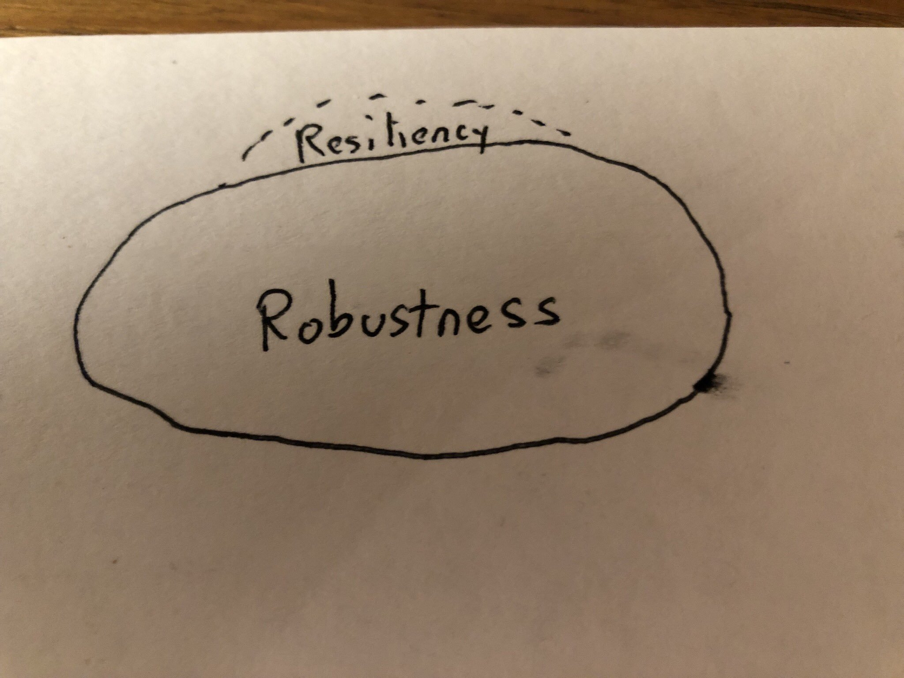

# Resilience engineering: Where do I start?

This an introductory guide to readings in *resilience engineering*, aimed at software engineers.

For an FAQ style introduction to resilience engineering, see [resilience-for-software](https://github.com/res-eng/resilience-for-software).

Key papers are organized into themes:

* [What is resilience?](#what-is-resilience)
* [Changing perspectives on accidents and safety](#changing-perspectives-on-accidents-and-safety)
* [Complex systems](#complex-systems)
* [Coordination](#coordination)
* [Automation](#automation)
* [Boundary as a model (Rasmussen)](#boundary-as-a-model-rasmussen)
* [David Woods](#david-woods)

The papers linked here should all be accessible to casual readers.

When you're ready for more, check out [resilience engineering notes](README.md).

## What is resilience?

A *resilient* organization **adapts effectively to surprise**.

Here I'm using the definition proposed by [David Woods](https://complexity.osu.edu/people/woods.2).
Before going into more detail about *resilience*, it's important to distinguish it from
a different concept that Woods calls *robustness*.

### Robustness vs. resilience

When we talk about designing highly available systems, we usually cover
techniques such as redundancy, retries, fallbacks, and failovers. We think about
what might go wrong (e.g., server failure, network partition), and design our
system to gracefully handle these situations.

Woods uses the term **robustness** to refer to systems that are designed to
effectively handle known failure modes.

**Resilience**, on the other hand, describes how well the system can handle
troubles that were not foreseeable by the designer. You can think of robustness
as being able to deal well with *known unknowns*, and resilience as being able
to deal well with *unknown unknowns*.

* [Four concepts for resilience and the implications for
the future of resilience
engineering]
by Woods discusses four different common usages of the term *resilience*.
In particular, he describes why he considers *robustness* to be a different concept.
* [Resilience is a verb] is another very readable paper on how Woods defines resilience.

[Four concepts for resilience and the implications for the future of resilience engineering]: https://www.researchgate.net/publication/276139783_Four_concepts_for_resilience_and_the_implications_for_the_future_of_resilience_engineering
[Resilience is a verb]: https://www.researchgate.net/publication/329035477_Resilience_is_a_Verb

## Changing perspectives on accidents and safety

Resilience engineering as a field emerged from the safety science community.
That's why you'll often see examples from aviation and medicine, as well as
other safety critical areas like maritime, space flight, nuclear power, and rail.

Because of this history, the earlier papers that we associate with resilience
engineering are reactions to previous ways of thinking about accidents in 
particular and safety in general.

Note that traditional approaches to safety often focus on minimizing variance
associated with humans doing work, using techniques such as documented
procedures and enforcement mechanisms for deviating from them. 

### New look / new view

The "new look" or "new view" refers to a change in perspective on how accidents
happen, which focuses on understanding how actions taken
by actors involved in the incident were rational, given what information those
actors had at the time that events were unfolding.

Johan Bergström of Lund University has three excellent short (<10 minute) videos:

* [Was it technical failure or human error?](https://www.youtube.com/watch?v=Ygx2AI2RtkI)
* [Three analytical traps in accident investigation](https://www.youtube.com/watch?v=TqaFT-0cY7U)
* [Two views on human error](https://www.youtube.com/watch?v=rHeukoWWtQ8)

Two great introductory papers (alas, both paywalled) are:

* [Reconstructing human contributions to accidents: the new view on error and performance](http://citeseerx.ist.psu.edu/viewdoc/download?doi=10.1.1.411.4985&rep=rep1&type=pdf) 
by Dekker 
* [The error of counting errors](https://doi.org/10.1016/j.annemergmed.2008.03.015) by Robert Wears

A great book on putting these ideas into practice in incident investigations is:

* [The Field Guide to Understanding "Human Error"](https://www.amazon.com/Field-Guide-Understanding-Human-Error/dp/1472439058/) by Dekker

### Safety-II

Safety-II is a perspective on the role that humans play in safety-critical 
systems, proposed by Erik Hollnagel. In the Safety-II perspective,
it is the everyday, normal work of the humans in the system that create the safety,
as opposed to the errors of humans that erode it.

* [From Safety-I to Safety-II: A White Paper](https://www.skybrary.aero/bookshelf/books/2437.pdf) by Hollnagel is a very readable
introduction to Safety-II concepts.
* [Why do things go right?](http://www.safetydifferently.com/why-do-things-go-right/) by Dekker on the [Safety Differently](http://www.safetydifferently.com) website is another good article.

## Complex systems 

Ever wonder why resilience engineering advocates natter on about "no root cause?" 

A recurring theme in resilience engineering is about reasoning holistically
about *systems*, as opposed to breaking things up into components and reasoning
about components separately. This perspective is known as *systems thinking*,
which is a school of thought that has been influential in the resilience
engineering community.

When you view the world as a system, the idea of *cause* becomes meaningless,
because there's no way to isolate an individual cause. Instead, the world is
a tangled web of influences.

You'll often hear the phrase *socio-technical system*. This language emphasizes that 
systems should be thought of as encompassing both humans and technologies, as opposed to
thinking about technological aspects in isolation. 

* [How complex systems fail](http://web.mit.edu/2.75/resources/random/How%20Complex%20Systems%20Fail.pdf) by Richard I. Cook is a great starting point. It's a short paper and very easy to read.
* [Drift into failure](https://www.goodreads.com/book/show/10258783) by Sidney Dekker is a book written for a lay audience, so it is also very readable. Dekker draws heavily from systems thinking to propose a theory about how complex systems can evolve into unsafe states.

## Coordination

The systems we are interested in often involve a collection of people working together
in some way to achieve a task. One particularly relevant example involves a collection of engineers
working together to troubleshoot and repair a system during an ongoing
incident.

* [Common Ground and Coordination in Joint Activity] is an oft-cited paper on what is required for people
to effectively coordinate when working on tasks together.

[Common Ground and Coordination in Joint Activity]: http://jeffreymbradshaw.net/publications/Common_Ground_Single.pdf

## Automation

One thing we software folk do have in common with the safety-critical world is
the increased adoption of automation. Automation introduces challenges, and
the nature of these challenges is a topic of many resilience engineering papers.

You might hear the phrase *joint cognitive system* in the context of automation. This terms refers to
systems that do cognitive work that are made up of a combination of humans and software.
There is an entire research discipline that studies joint cognitive systems called *cognitive systems engineering*, initially
developed by David Woods and Erik Hollnagel, both of whom would both later go on to play a significant role in
developing the field of resilience engineering.

Because resilience engineering researchers like Woods and Hollnagel have their roots in cognitive
systems engineering, and because of the ever-increasing use of software automation in society,
this community is very concerned about the potential *brittleness* associated with poor
use of automation.

* [Ironies of automation](https://www.ise.ncsu.edu/wp-content/uploads/2017/02/Bainbridge_1983_Automatica.pdf) by Lisanne
Bainbridge is a classic paper on the problems that automation can introduce.
The paper was originally written in 1983, and continues to be widely cited. 

* [How to make automated systems team players](https://researchgate.net/publication/2483863)
by Christoffersen and Woods discusses how previous automated systems have been problematic and proposes strategies
for improving automating.

* [Ten challenges for making automation a team player](https://ieeexplore.ieee.org/abstract/document/1363742)
by Klein et al. is a more recent paper that outlines the requirements for automation to be genuinely effective in
socio-technical systems. This work draws heavily from the theme of *coordination* discussed earlier.

## Boundary as a model (Rasmussen)

The late Jens Rasmussen is an enormously influential figure in the resilience engineering community.

* [Risk management in a dynamic society: a modelling problem](https://doi.org/10.1016/S0925-7535(97)00052-0), published in 1997,
is one of Rasmussen's most famous papers, which introduces Rasmussen's *dynamic safety model*.

In this widely cited paper, Rasmussen advocates for a cross-disciplinary,
systems-based approach to thinking about how accidents occur. He argues that
accidents occur because the system migrates across a dangerous boundary, and
this migration occurs during the course of normal work.

Here is a depiction of the model from that paper:

## David Woods

We've already referenced several papers authored or co-authored by
David Woods. Woods is a force of nature in the field of resilience engineering, having
played a key role in creating the field itself. Woods is incredibly prolific,
and has introduced a wide variety of concepts related to resilience
engineering.

Woods is interested in resilience engineering principles that apply across an
enormous range of different types of systems: whether we're talking about
the organs in a biological organism up to organizations like NASA. 

Because he's interested in general principles, many of his papers are written at
a very abstract level, where he discusses generic concepts such as *units of adaptive
behavior* or *saturation*.

### Dragons at the boundary

David Woods uses the metaphor of a system moving within a boundary in his writings on resilience engineering, but in
a slightly different way than Rasmussen.

Woods sees the boundary as a *competence envelope*. There are two different regimes of system behavior: far from the boundary and near the boundary.

When a system is far from the boundary, the system (and its environment) behave as expected. By contrast, when a system
grows near to the boundary, surprises happen. Woods uses the metaphor of *dragons* to capture the surprises that occur when a system moves near the boundary, and how the system's model of the world is violated when it enters this regime.

It is how units within a system adapt when the system moves near the boundary, how these units deal with the dragons,
that is one of the prime concerns of Woods. 

Woods's [Essentials of Resilience, revisited](https://www.researchgate.net/profile/David_Woods11/publication/330116587_4_Essentials_of_resilience_revisited/links/5c2e448ba6fdccd6b58f871e/4-Essentials-of-resilience-revisited.pdf?origin=publication_detail) discusses behavior at the boundary, although it doesn't use the *dragon* metaphor.

### The adaptive universe

Woods's idea of the *adaptive universe* is characterized by three properties:

* Resources are finite
* Surprise is fundamental
* Change never stops

I haven't found a good introductory paper for the adaptive universe, as it 
encompasses an enormous number of topics, including the topic of *dragons at the boundaries*
that we discussed earlier.

I recommend watching Woods's [Resilience Engineering short
course](http://csel.org.ohio-state.edu/ResilienceEngineering.html), which
covers this topic.  I've written my own [notes on the short
course](https://github.com/lorin/res-eng-short-course-notes), which you might
find useful. In particular, you might be interested in my [summary
notes](https://github.com/lorin/res-eng-short-course-notes/blob/master/summary.md).

### Graceful extensibility

Woods introduced the theory of *graceful extensibility* to capture how successful
systems adapt effectively to surprise. The most relevant paper here is:

* [The theory of graceful extensibility: basic rules that govern adaptive systems](https://link.springer.com/article/10.1007%2Fs10669-018-9708-3).

